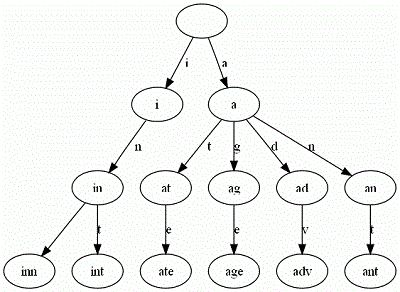

# 海量字符串搜索之一 Trie树

 发表于 2015-11-02 | 分类于 [算法 ](https://shenlvmeng.github.io/blog/categories/算法/)| [0 Comments](https://shenlvmeng.github.io/blog/2015/11/02/trie/#comments)

前言：编程第一次大作业，海量字符串检索。C语言，并要求使用trie树结构以及bloomfilter两种技术实现，体会它们的特点。这里对Trie做些学习笔记。

## Trie树

Trie树，又称单词查找树、字典树，是一种树形结构，是一种哈希树的变种，是一种用于快速检索的多叉树结构。典型应用是用于统计和排序大量的字符串（但不仅限于字符串），所以经常被搜索引擎系统用于文本词频统计。**它的优点是：最大限度地减少无谓的字符串比较，查询效率比哈希表高。**

**Trie的核心思想是空间换时间。**利用字符串的公共前缀来降低查询时间的开销以达到提高效率的目的，例如邮箱的公共后缀。

**Trie树也有它的缺点**,Trie树的内存消耗非常大.当然,或许用左儿子右兄弟的方法建树的话,可能会好点.

### 特点

1. 根节点不包含字符，除根节点外每一个节点都只包含一个字符。
2. 从根节点到某一节点，路径上经过的字符连接起来，为该节点对应的字符串。
3. 每个节点的所有子节点包含的字符都不相同
   例如，给出一组单词：inn, int, at, age, adv, ant, 我们可以得到下面的Trie树

[](https://shenlvmeng.github.io/blog/images/trie-1.gif)

可以看出：

- 每条边对应一个字母。
- 每个节点对应一项前缀。叶节点对应最长前缀，即单词本身。
- 单词inn与单词int有共同的前缀“in”, 因此他们共享左边的一条分支，root->i->in。同理，ate, age, adv, 和ant共享前缀”a”，所以他们共享从根节点到节点”a”的边。

### 实现

#### 1. 插入过程

对于新的单词，从根开始，沿着单词的各个字母所对应的树中的节点分支向下走，直到单词遍历完，将最后的节点做标记，表示该单词已插入trie树。

#### 2. 检索过程

从根开始按照单词的字母顺序向下遍历trie树，一旦发现某个节点标记不存在或者单词遍历完成而最后的节点没有标记，则表示该单词不存在，若最后的节点有标记，表示该单词存在。

#### 3. 删除节点

很少使用，从该节点开始，释放它和所有子节点占用的空间。

#### 4. 代码

```c
#include <stdlib.h>
#include <stdio.h>
#include <string.h>

typedef struct TrieNode {
	int count; //statistics
	struct TrieNode* next[MAX];
}TrieNode;

TrieNode* CreateNode(){
	TrieNode* p = (TrieNode*)malloc(sizeof(TrieNode));
	p->count=0;
	memset(p->next, 0, sizeof(p->next));
	return p;
}

/*Insert new entry*/
void InsertTrieNode(TrieNode* pRoot, char *s, int flag){
	TrieNode *p = pRoot;
	int i,k;
	i = 0;
	while(s[i]){
		//confirm branch
		if(s[i] >= '0' && s[i] <= '9')
 			k = s[i++] - '0' + 2;
 		else if(s[i] >= '@' && s[i] <='Z')
 			k = s[i++] - '@' + 12;
 		else if(s[i] >= 'a' && s[i] <= 'z')
 			k = s[i++] - 'a' + 13;
 		else if(s[i] == '.' || s[i] == '-')
 			k = s[i++] - '-';
 		else if(s[i] == '_'){
 			k = 39;i++;
 		}
 		else
 			return;
 		if(NULL == p->next[k]) 
			p->next[k] = CreateNode();		
		p = p->next[k];
	}
	//mark the trie string
	p->count = flag;
}

/*Match certain string*/
int SearchTrie(TrieNode* pRoot, char *s){
	TrieNode *p = pRoot;
	int i,k;
	i = 0;
	while(s[i]){
		if(s[i] >= '0' && s[i] <= '9')
 			k = s[i++] - '0' + 2;
 		else if(s[i] >= '@' && s[i] <='Z')
 			k = s[i++] - '@' + 12;
 		else if(s[i] >= 'a' && s[i] <= 'z') 
			k = s[i++] - 'a' + 13;
 		else if(s[i] == '.' || s[i] == '-')
 			k = s[i++] - '-';
 		else if(s[i] == '_'){
 			k = 39;i++;
 		}
 		else
 			return 0;
 		if(p->next[k] == NULL)
			return 0;
		p = p->next[k];
	}
	if(p->count > 0){
		return p->count;
	}
	else
		return 0;
}

}
```

运行结果略。

### 查找性能分析

在trie树中查找一个关键字的时间和树中包含的结点数无关，而取决于组成关键字的字符数。而二叉查找树的查找时间和树中的结点数有关O(log2n)。

如果要查找的关键字可以分解成字符序列且不是很长，利用trie树查找速度优于二叉查找树。如：若关键字长度最大是5，则利用trie树，利用5次比较可以从26^5＝11881376个可能的关键字中检索出指定的关键字。而利用二叉查找树至少要进行约23.5次比较。

### Trie树的应用

- 串的快速检索：
  给出N个单词组成的熟词表，以及一篇全用小写英文书写的文章，请你按最早出现的顺序写出所有不在熟词表中的生词。
  在这道题中，我们可以用数组枚举，用哈希，用字典树，先把熟词建一棵树，然后读入文章进行比较，这种方法效率是比较高的。
- 串排序：
  给定N个互不相同的仅由一个单词构成的英文名，让你将他们按字典序从小到大输出。
  用字典树进行排序，采用数组的方式创建字典树，这棵树的每个结点的所有儿子很显然地按照其字母大小排序。对这棵树进行先序遍历即可。
- 最长公共前缀
  对所有串建立字典树，对于两个串的最长公共前缀的长度即他们所在的结点的公共祖先个数，于是，问题就转化为当时公共祖先问题（以后补上）。

### Patricia Trie

针对，Trie树占用空间较多的缺点。可以对每个trie树节点做压缩工作，从而节省程序占用的内存空间。如果一颗Trie中有很多单词只有一个儿子结点，可以用Patricia Trie（Linux内核中叫做Radix Tree）压缩存储。由于#结束符标记被看作是一个叶子结点，那么一颗Patricia Trie的任何内部结点有2个或以上的孩子结点。

Linux radix树最广泛的用途是用于内存管理，结构address_space通过radix树跟踪绑定到地址映射上的核心页，该radix树允许内存管理代码快速查找标识为dirty或writeback的页。Linux radix树的API函数在lib/radix-tree.c中实现。

作为Trie树的优化变异，Patricia树也可进行Trie树的操作。实现略。

## Trie树之外

除了Trie树，最常用的字符串检索有[Knuth-Morris-Pratt](https://en.wikipedia.org/wiki/Knuth–Morris–Pratt_algorithm)算法（最长前缀匹配），以及[Boyer-Moore](https://en.wikipedia.org/wiki/Boyer–Moore_string_search_algorithm)算法（最长后缀匹配）。关于这两个算法，参考资料的6和7的链接是我见过介绍的最好的，深入浅出易于理解。这里就不再废话了。