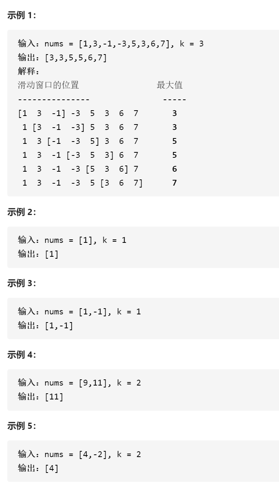

滑动窗口最大值



变量简洁正确完整思路

窗口只需要最大值，用priority_queue num2index 先放前k个{num, i}再更新答案

再每push一个就只要num2index.top().second<=i-k就q.pop直到最大值在窗口i-k内，更新答案，窗口逻辑左边界i-k+1，如果top在左边界右边就不pop，一旦最小值在左边界左边就pop直到最大值在右边，这就是懒更新，时间复杂度nlogn，插入删除logn

```c
class Solution {
public:
    vector<int> maxSlidingWindow(vector<int>& nums, int k) {
        priority_queue<pair<int,int>>num2index;
        vector<int>ans;
        for(int i=0;i<k;i++){
            num2index.push({nums[i],i});
        }
        ans.push_back(num2index.top().first);
        for(int i=k;i<nums.size();i++){
            num2index.push({nums[i],i});
            while(num2index.top().second<=i-k)num2index.pop();
            ans.push_back(num2index.top().first);
        }
        return ans;
    }
};
```


变量简洁正确完整思路

单调双端队列window保存下标，front是最大元素下标，back是最小元素下标，对

numsi>numsback就popback，while，直到numsi<numsback，然后pushback，

对于numsi还需要front更新结果，前提是while window.front<i-k+1 就popfront

直到窗口内部

```c
class Solution {
public:
    vector<int> maxSlidingWindow(vector<int>& nums, int k) {
        deque<int>window;
        vector<int>ans;
        for(int i=0;i<k;i++){
            while(!window.empty()&&nums[i]>nums[window.back()])window.pop_back();
            window.push_back(i);
        }
        ans.push_back(nums[window.front()]);
        for(int i=k;i<nums.size();i++){
            while(!window.empty()&&nums[i]>nums[window.back()])window.pop_back();
            window.push_back(i);
            while(window.front()<i-k+1)window.pop_front();
            ans.push_back(nums[window.front()]);
        }
        return ans;
    }
};
```

