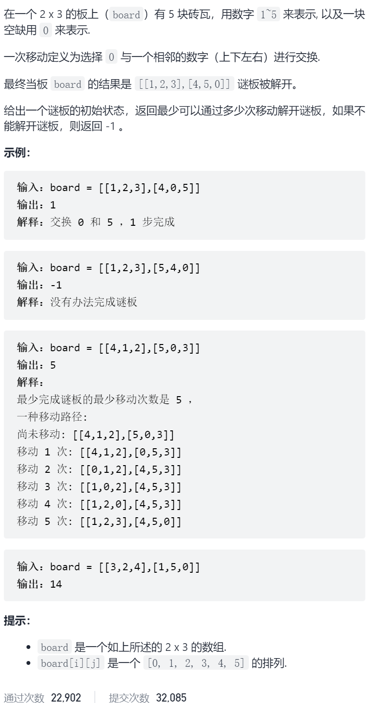
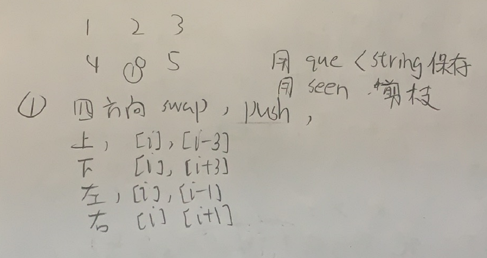

滑动谜题



抽象图一二ij

最短路径用bfs




```c
class Solution {
public:
    int slidingPuzzle(vector<vector<int>>& board) {
        queue<string>que;
        que.push(process(board));
        int ans=0;
        string target="123450";
        unordered_set<string>seen;
        while(!que.empty()){
            for(int i=que.size();i>0;i--){
                string s=que.front();que.pop();
                //cout<<s<<endl;
                if(s==target)return ans;
                int j=s.find('0');
                string tmp=s;
                if(j<3){
                    swap(tmp[j],tmp[j+3]);
                    if(seen.count(tmp)==0){
                        que.push(tmp);
                        seen.insert(tmp);
                    }
                }else {
                    swap(tmp[j],tmp[j-3]);
                    if(seen.count(tmp)==0){
                        que.push(tmp);
                        seen.insert(tmp);
                    }
                }
                tmp=s;
                if(j!=2&&j!=5){
                    swap(tmp[j],tmp[j+1]);
                    if(seen.count(tmp)==0){
                        que.push(tmp);
                        seen.insert(tmp);
                    }
                }
                tmp=s;
                if(j!=0&&j!=3){
                    swap(tmp[j],tmp[j-1]);
                    if(seen.count(tmp)==0){
                        que.push(tmp);
                        seen.insert(tmp);
                    }
                }
            }
            ans++;
            //cout<<que.size()<<endl;
        }
        return -1;
    }
    string process(vector<vector<int>>&board){
        string ans;
        for(int i=0;i<board.size();i++){
            for(int j=0;j<board[0].size();j++){
                ans+=to_string(board[i][j]);
            }
        }
        return ans;
    }
};
```


