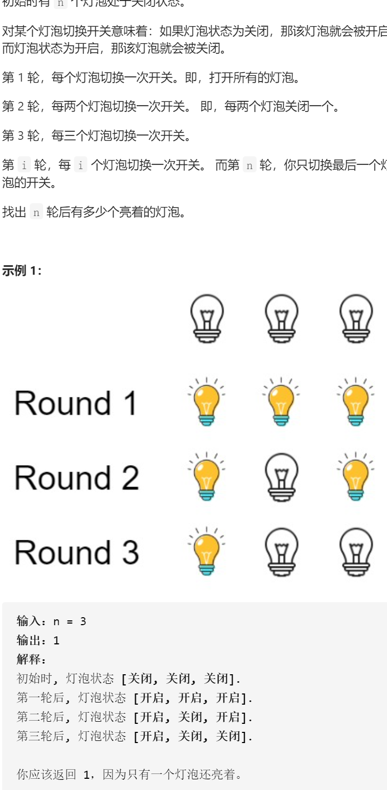

灯泡开关



对于10号灯，1 2 5 10轮会调整

对于16号灯，1 2 4 8 16轮会调整

调整奇数，亮，调整偶数次，暗

1 4 9 16 。。。奇数

其余偶数

完全平方数为奇数，统计完全平方数

```c
class Solution {
public:
    int bulbSwitch(int n) {
        int ans=0;
        for(int i=1;i*i<=n;i++)ans++;
        return ans;
    }
};
```

