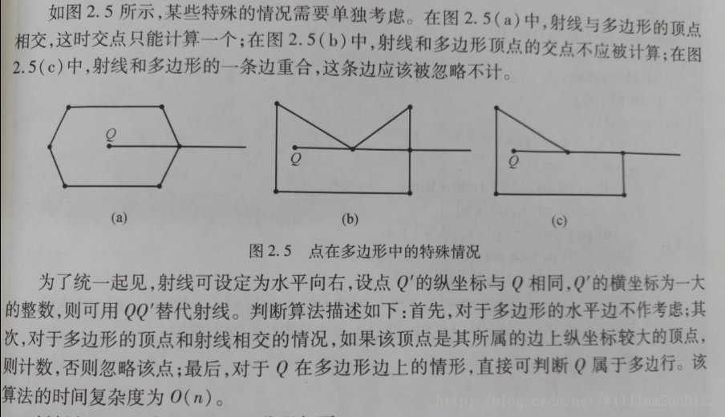

射线法
时间复杂度：O（n） 适用范围：任意多边形
个人认为是非常不错的算法（不需考虑精度误差和多边形点给出的顺序），可以作为第一选择。

算法思想：
以被测点Q为端点，向任意方向作射线（一般水平向右作射线），统计该射线与多边形的交点数。如果为奇数，Q在多边形内；如果为偶数，Q在多边形外。计数的时候会有一些特殊情况，如图




图片已经把特殊情况和算法实现说的很清楚了，下面我直接贴代码，具体可看代码注释。

```c
const double eps = 1e-6;
const double PI = acos(-1);
//三态函数，判断两个double在eps精度下的大小关系
int dcmp(double x)
{
    if(fabs(x)<eps) return 0;
    else
        return x<0?-1:1;
}
//判断点Q是否在P1和P2的线段上
bool OnSegment(Point P1,Point P2,Point Q)
{
    //前一个判断点Q在P1P2直线上 后一个判断在P1P2范围上
    return dcmp((P1-Q)^(P2-Q))==0&&dcmp((P1-Q)*(P2-Q))<=0;
}
//判断点P在多边形内-射线法
bool InPolygon(Point P)
{
    bool flag = false; //相当于计数
    Point P1,P2; //多边形一条边的两个顶点
    for(int i=1,j=n;i<=n;j=i++)
    {
        //polygon[]是给出多边形的顶点
        P1 = polygon[i];
        P2 = polygon[j];
        if(OnSegment(P1,P2,P)) return true; //点在多边形一条边上
        //前一个判断min(P1.y,P2.y)<P.y<=max(P1.y,P2.y)
        //这个判断代码我觉得写的很精妙 我网上看的 应该是大神模版
        //后一个判断被测点 在 射线与边交点 的左边
        if( (dcmp(P1.y-P.y)>0 != dcmp(P2.y-P.y)>0) && dcmp(P.x - (P.y-P1.y)*(P1.x-P2.x)/(P1.y-P2.y)-P1.x)<0)
            flag = !flag;
    }
    return flag;
}

```

