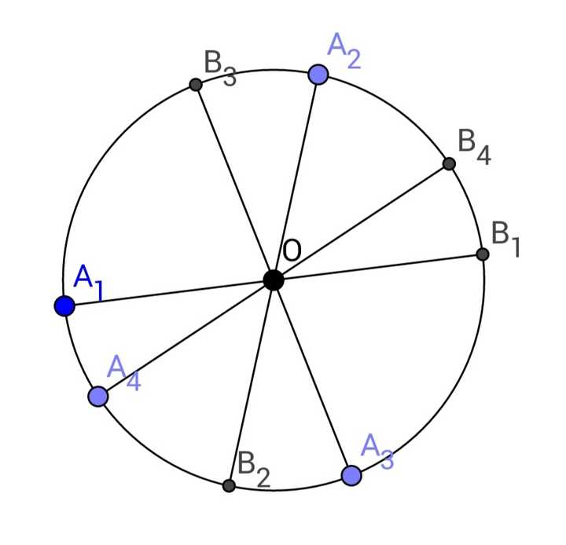
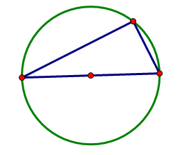
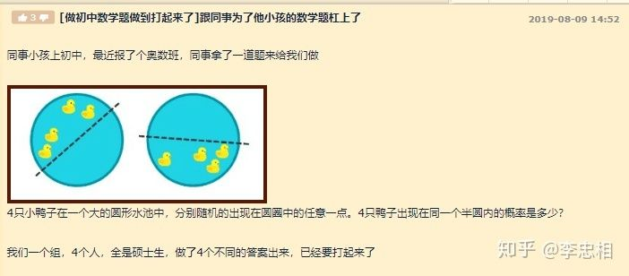
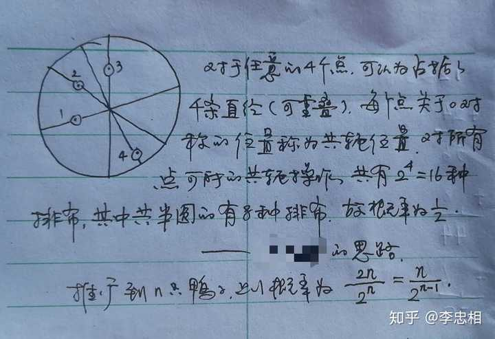
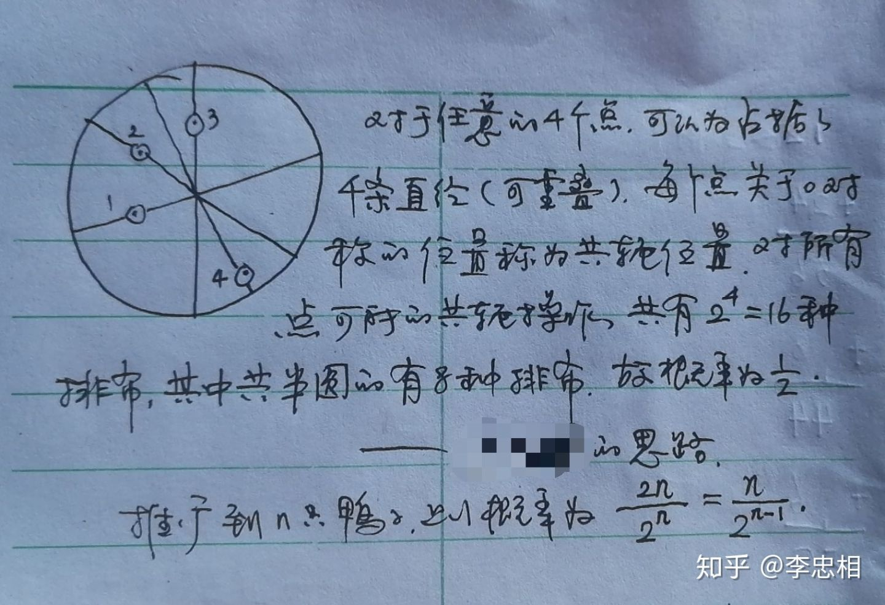

大家的做法好像都有点麻烦……我用高中（有点竞赛？）的方法解答。

设四个点为 C₁ , C₂ , C₃ , C₄ 分别位于直径 A₁B₁ , A₂B₂ , A₃B₃ , A₄B₄ 上。不妨设四条直径各不相同，且四个点都不在圆心 O 处。

易得 Cₘ 位于半径 OAₘ 与半径 OBₘ 的概率都是 1/2 ，而 C₁ , C₂ , C₃ , C₄ 共半圆等价于所在的四条半径相邻！

于是我们转化为了古典概型：在四条直径中各选一条半径，则四条半径相邻的概率是？

用古典概型公式：

P = Ω / Ω₀ = (2×4) / (2^4)  = 1/2

注意到，这个概率的大小与四条直径的位置没有关系！所以当四个点等[概率密度](https://www.zhihu.com/search?q=概率密度&search_source=Entity&hybrid_search_source=Entity&hybrid_search_extra={"sourceType"%3A"answer"%2C"sourceId"%3A783235268})分布在圆内时，落在同一个半圆内的概率是 1/2 。

------

那么我们可以轻松地推广到 n 个点的情况，只要转化为 2n 条半径的古典概型问题：

Pₙ = Ω / Ω₀ = 2n / (2^n)  = n/2^(n-1) 

------

灵感来源则是这道题：

[圆上任选三点组成三角形，这个三角形是锐角、钝角和直角三角形的概率分别是多少？230 赞同 · 33 评论回答](https://www.zhihu.com/question/19824740/answer/314099336)

圆周上三个点构成[钝角三角形](https://www.zhihu.com/search?q=钝角三角形&search_source=Entity&hybrid_search_source=Entity&hybrid_search_extra={"sourceType"%3A"answer"%2C"sourceId"%3A783235268})，其实就是在同一个半圆上！

------

[@李忠相](http://www.zhihu.com/people/87ae064544b081c9181c5d042aba2ead)

 在我回答的前一天发了一篇文章

[李忠相：圆中四鸭属于一个半圆的概率28 赞同 · 6 评论文章](https://zhuanlan.zhihu.com/p/77735377)

我们似乎发现了这个问题的原型：

游过一群鸭

他的学生 Lsh 给出了相似的做法：

我没看过哦

这个“[共轭变换](https://www.zhihu.com/search?q=共轭变换&search_source=Entity&hybrid_search_source=Entity&hybrid_search_extra={"sourceType"%3A"answer"%2C"sourceId"%3A783235268})”是等距变换，所以是保测度的，点落在变换前后位置的可能性是相同的！因此这个做法是非常棒的。

结论：

1. 抓准问题的特殊性，经常会有意想不到而正中要害的做法。本题便是利用了圆的[对称性](https://www.zhihu.com/search?q=对称性&search_source=Entity&hybrid_search_source=Entity&hybrid_search_extra={"sourceType"%3A"answer"%2C"sourceId"%3A783235268})，事实上换为球也可以用到这样的思想（会难一些！）。
2. 做学问应平心静气讨论，不要打架 。