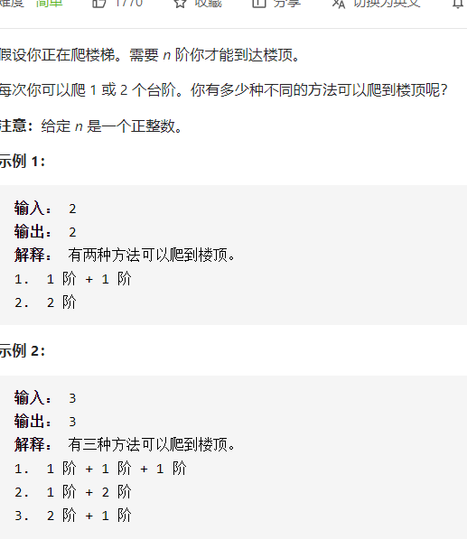

爬楼梯



详细思路

第i阶时具有某种递推关系

精确定义

dpi 到达第i阶具有的方法，dp0是没有一阶，dp1是第1阶

转移

\- - - - dpi =dp i-1 +dpi-2

初始化

dp0 =0 dp1=1

优化空间

dpi=dpi1+dpi2

dpi2=dpi1

dpi1=dpi

```c
class Solution {
public:
    int climbStairs(int n) {
        if(n==1)return 1;
        if(n==2)return 2;
        int dpi2=1,dpi1=2;
        for(int i=3;i<=n;i++){
            int dpi=dpi1+dpi2;
            dpi2=dpi1;
            dpi1=dpi;
        }
        return dpi1;
    }   
};


```

