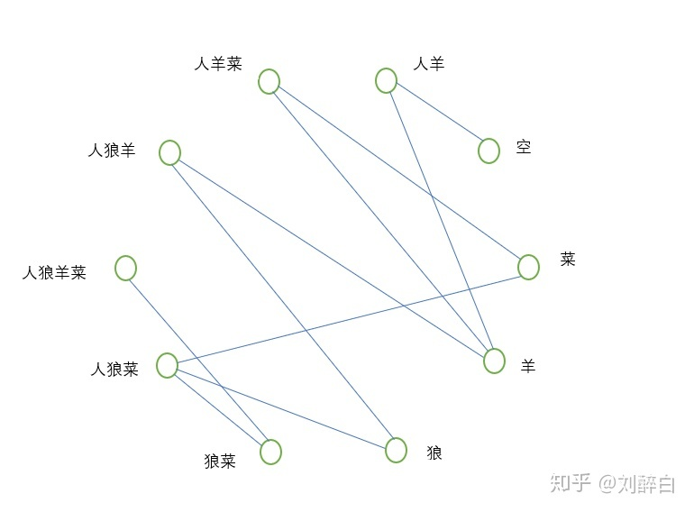
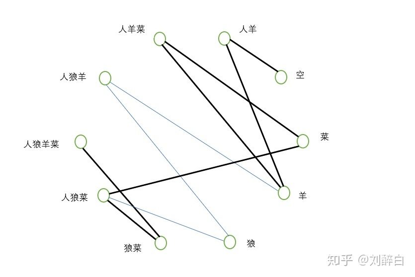
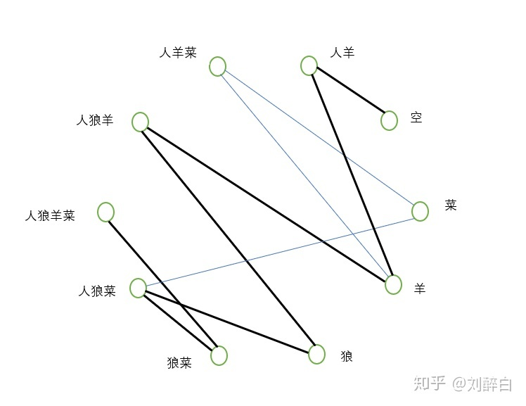

# 问怎样才能把狼,羊,白菜都安全过河?

一个猎人带着一只羊，一只狼和一棵白菜回家，路上遇到一条河。河边只有一条船，但船太小，-次最多只可载猎人和另一样东西过河。但猎人不在时，狼要吃羊，羊要吃白菜。请问怎样才能把狼，羊，白菜都安全运过河?下翻有答案

答案:人先把羊带过去,然后回来接狼过河,过去之后再把羊带回来,回来过后把羊放下再把白菜带过去,然后回来接羊

嗯，可以想想答案每一步是为什么，核心就是在人不在的时候不能让狼和羊、羊和菜在一起，所以在人不在的时候只能让狼和菜在一起，而且此题步骤最少的运法不唯一。

下面我给一个[图论](https://www.zhihu.com/search?q=图论&search_source=Entity&hybrid_search_source=Entity&hybrid_search_extra={"sourceType"%3A"answer"%2C"sourceId"%3A1617653477})的解法：

河边一共只有十种状态是可以存在的，分别是人狼羊菜、人羊菜、人狼菜、人狼羊、狼菜、人羊、狼、羊、菜、空。

**以每种状态作为一个顶点，状态之间如果可以转化，那么这两个状态对应的顶点之间连一条边**，那么此题对应的图如下：

此题**步骤最少的运法**就是**从“人狼羊菜”这个顶点到“空”这个顶点的一条最短路径**。一般地，求给定的两点之间的最短路径可以使用[Dijkstra算法](https://www.zhihu.com/search?q=Dijkstra算法&search_source=Entity&hybrid_search_source=Entity&hybrid_search_extra={"sourceType"%3A"answer"%2C"sourceId"%3A1617653477})。

此题的两个解是：

其中第一个解就对应你给的解：人先把羊带过去，然后回来接狼过河，过去之后再把羊带回来，回来过后把羊放下，再把白菜带过去，然后回来接羊。

第二个解对应的是：人先把羊带过去，然后回来把白菜带过去，过去之后再把羊带回来，回来过后把羊放下，然后接狼过河，然后回来接羊。