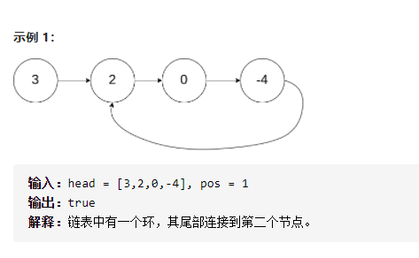
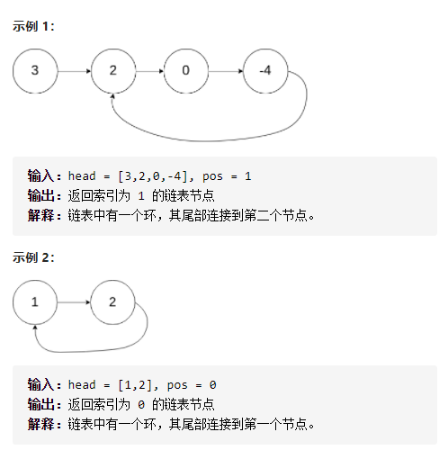
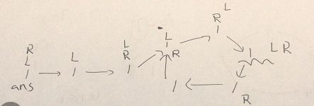

环形链表



变量简洁正确完整思路

快慢指针fastlow，如果相遇true

精确定义

```c
class Solution {
public:
    bool hasCycle(ListNode *head) {
        if(!head)return false;
        ListNode*fast=head,*low=head;
        if(head->next)fast=fast->next;
        while(fast&&fast->next){
            if(fast==low)return true;
            fast=fast->next->next;
            low=low->next;
        }
        return false;
    }
};
```

------

环形链表II



变量简洁正确完整思路

slow每次走一步fast每次走两步，相遇，ans从起点，和slow同时走，相遇，返回相遇点

画图



```c
class Solution {
public:
    ListNode *detectCycle(ListNode *head) {
        ListNode*L=head,*R=head;
        bool hadCircle=false;
        while(R&&R->next){
            L=L->next;
            R=R->next->next;
            if(L==R){
                hadCircle=true;
                break;
            }
        }
        if(hadCircle){
            ListNode*ans=head;
            while(ans!=L)ans=ans->next,L=L->next;
            return ans;
        }
        return nullptr;
    }
};
```

