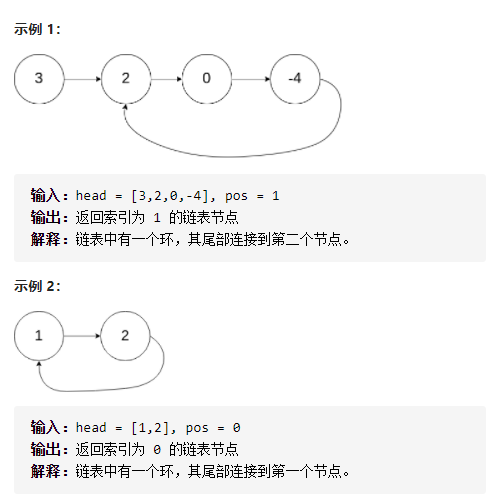
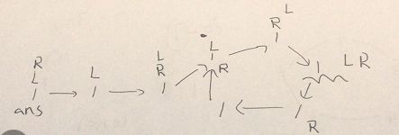

环形链表II



变量简洁正确完整思路

slow每次走一步fast每次走两步，相遇，ans从起点，和slow同时走，相遇，返回相遇点

画图



```c
class Solution {
public:
    ListNode *detectCycle(ListNode *head) {
        ListNode*L=head,*R=head;
        bool hadCircle=false;
        while(R&&R->next){
            L=L->next;
            R=R->next->next;
            if(L==R){
                hadCircle=true;
                break;
            }
        }
        if(hadCircle){
            ListNode*ans=head;
            while(ans!=L)ans=ans->next,L=L->next;
            return ans;
        }
        return nullptr;
    }
};
```


不用哈希表

方法一：哈希表
思路与算法

一个非常直观的思路是：我们遍历链表中的每个节点，并将它记录下来；一旦遇到了此前遍历过的节点，就可以判定链表中存在环。借助哈希表可以很方便地实现。

代码


```c
class Solution {
public:
    ListNode *detectCycle(ListNode *head) {
        unordered_set<ListNode *> visited;
        while (head != nullptr) {
            if (visited.count(head)) {
                return head;
            }
            visited.insert(head);
            head = head->next;
        }
        return nullptr;
    }
};
```

复杂度分析

时间复杂度：O(N)O(N)，其中 NN 为链表中节点的数目。我们恰好需要访问链表中的每一个节点。

空间复杂度：O(N)O(N)，其中 NN 为链表中节点的数目。我们需要将链表中的每个节点都保存在哈希表当中。

