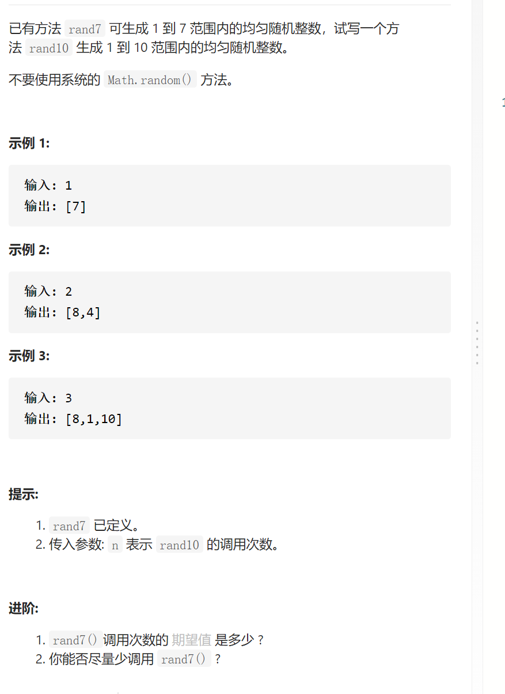
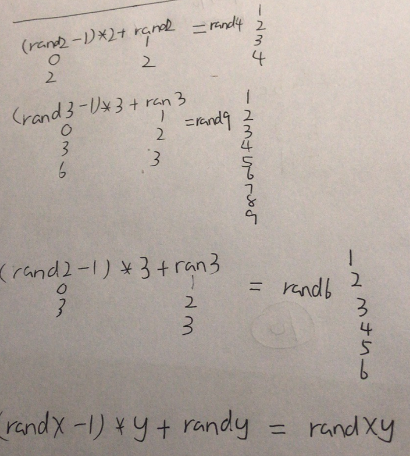
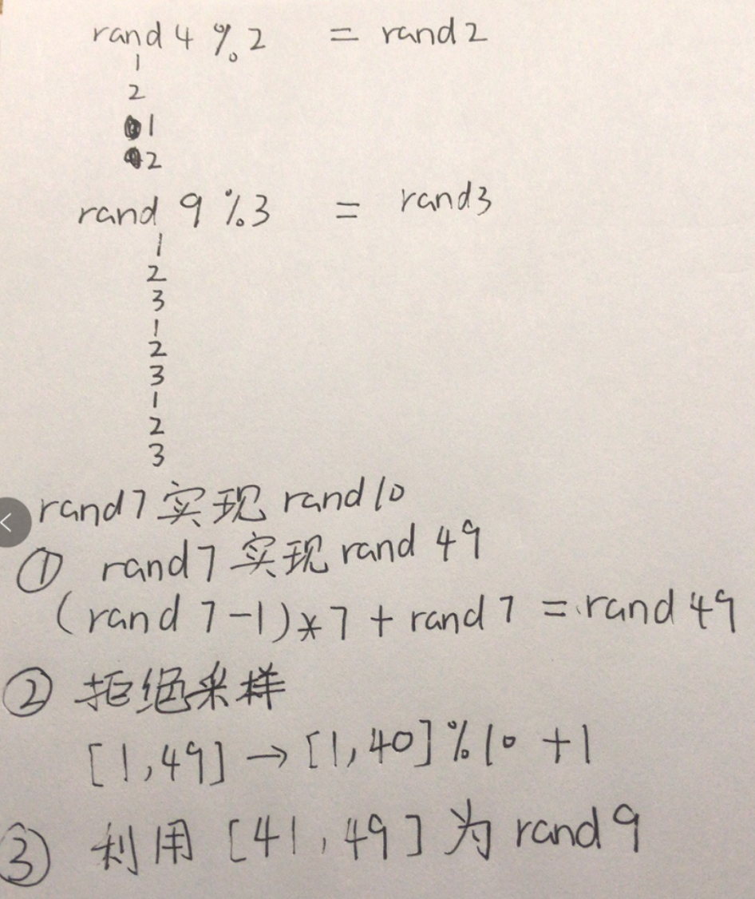

用Rand7()实现Rand10()

抽象固定维护寻找



```c
class Solution {
public:
    int rand10() {
        while(1){
            int a=rand7();
            int b=rand7();
            int sum=(a-1)*7+b;//rand49
            if(sum<=40)return sum%10+1;
            a=sum-40;
            b=rand7();
            sum=(a-1)*7+b;//rand63
            if(sum<=60)return sum%10+1;
            a=sum-60;
            b=rand7();
            sum=(a-1)*7+b;//rand21
            if(sum<=20)return sum%10+1;
        }
    }
};
```

