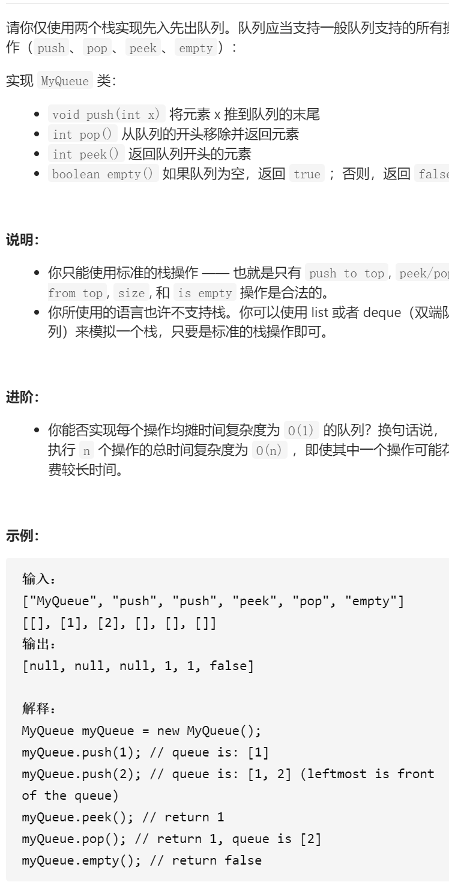

用栈实现队列




变量简洁正确完整思路

stk1stk2，pop、peek、empty都stk1，比如1234，123放到stk1,1在最上面，这时4，先123放到stk2，4放到stk2，在stk2放到stk1

```c
class MyQueue {
public:     
    stack<int>stk1,stk2;
    /** Initialize your data structure here. */
    MyQueue() {

    }
    
    /** Push element x to the back of queue. */
    void push(int x) {
        while(!stk1.empty()){
            stk2.push(stk1.top());
            stk1.pop();
        }
        stk2.push(x);
        while(!stk2.empty()){
            stk1.push(stk2.top());
            stk2.pop();
        }
    }
    
    /** Removes the element from in front of queue and returns that element. */
    int pop() {
        int x=stk1.top();
        stk1.pop();
        return x;
    }
    
    /** Get the front element. */
    int peek() {
        return stk1.top();
    }
    
    /** Returns whether the queue is empty. */
    bool empty() {
        return stk1.empty();
    }
};

/**
 * Your MyQueue object will be instantiated and called as such:
 * MyQueue* obj = new MyQueue();
 * obj->push(x);
 * int param_2 = obj->pop();
 * int param_3 = obj->peek();
 * bool param_4 = obj->empty();
 */

inout两个栈，push就push到in，pop就从outpop，如果out空就in全部到out，peek利用
pop函数
class MyQueue {
public:
    stack<int>in,out;
    /** Initialize your data structure here. */
    MyQueue() {

    }
    
    /** Push element x to the back of queue. */
    void push(int x) {
        in.push(x);
    }
    
    /** Removes the element from in front of queue and returns that element. */
    int pop() {
        int x;
        if(out.empty()){
            while(!in.empty()){
                out.push(in.top());
                in.pop();
            }
        }
        x=out.top();
        out.pop();
        return x;
    }
    
    /** Get the front element. */
    int peek() {
        int ans=this->pop();
        out.push(ans);
        return ans;
    }
    
    /** Returns whether the queue is empty. */
    bool empty() {
        return in.empty()&&out.empty();
    }
};

/**
 * Your MyQueue object will be instantiated and called as such:
 * MyQueue* obj = new MyQueue();
 * obj->push(x);
 * int param_2 = obj->pop();
 * int param_3 = obj->peek();
 * bool param_4 = obj->empty();
 */
```


