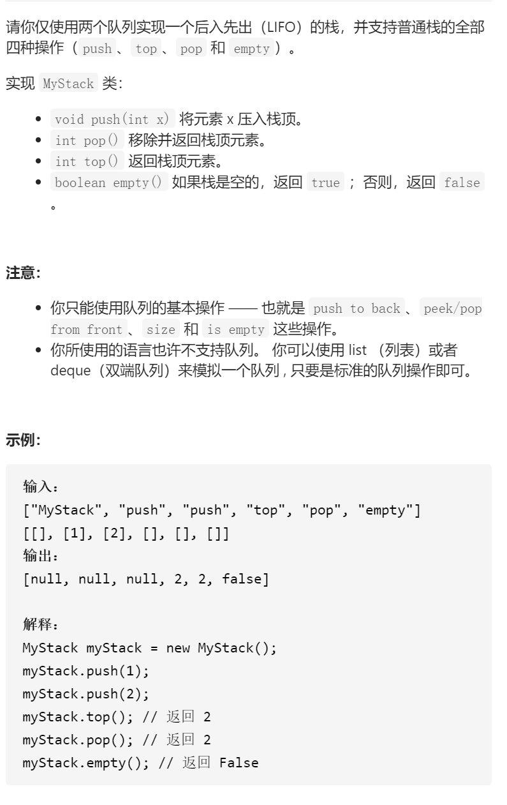

用队列实现栈



变量简洁正确完整思路

que1que2，top就是return que1.front()，pop就是pop并return que1.top，empty就是return que1.empty，就是以que1为基础，所以pushx为了x先进后出，把x放到que2底部并把que1所有放到que2，并que2作为新的que1，swap(que2que1)

```c
class MyStack {
public:
    queue<int>que1,que2;
    /** Initialize your data structure here. */
    MyStack() {

    }
    
    /** Push element x onto stack. */
    void push(int x) {
        que2.push(x);
        while(!que1.empty()){
            que2.push(que1.front());
            que1.pop();
        }
        swap(que1,que2);
    }
    
    /** Removes the element on top of the stack and returns that element. */
    int pop() {
        int x=que1.front();
        que1.pop();
        return x;
    }
    
    /** Get the top element. */
    int top() {
        return que1.front();
    }
    
    /** Returns whether the stack is empty. */
    bool empty() {
        return que1.empty();
    }
};

变量简洁正确完整思路
que，push的时候pushx，然后循环n-1次把尾部拿到头部，直到x到达尾部

class MyStack {
public:
    queue<int>que1;
    /** Initialize your data structure here. */
    MyStack() {

    }
    
    /** Push element x onto stack. */
    void push(int x) {
        que1.push(x);
        for(int i=0;i<que1.size()-1;i++){
            que1.push(que1.front());
            que1.pop();
        }
    }
    
    /** Removes the element on top of the stack and returns that element. */
    int pop() {
        int x=que1.front();
        que1.pop();
        return x;
    }
    
    /** Get the top element. */
    int top() {
        return que1.front();
    }
    
    /** Returns whether the stack is empty. */
    bool empty() {
        return que1.empty();
    }
};

/**
 * Your MyStack object will be instantiated and called as such:
 * MyStack* obj = new MyStack();
 * obj->push(x);
 * int param_2 = obj->pop();
 * int param_3 = obj->top();
 * bool param_4 = obj->empty();
 */
```


