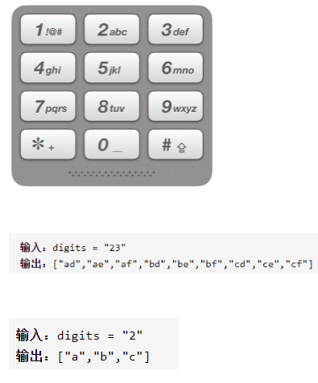

电话号码的字母组合



详细思路

哈希表映射数字对应的字符串，从第0层开始，找到该层对应的字符串，遍历字符串，将第一个字符放到数组并进入下一层，或者不要这个字符而尝试第二个字符，当层数=最后一个数字则找到一种

精确定义

numtoStr哈希表数字映射字符串

depth递归层数也是第几个数字

str该层对应字符串

c字符串中考虑要不要的字符

ans1某一种组合

ans所有组合

```c
class Solution {
public:
    unordered_map<char,string>numToStr={
            {'2',"abc"},
            {'3',"def"},
            {'4',"ghi"},
            {'5',"jkl"},
            {'6',"mno"},
            {'7',"pqrs"},
            {'8',"tuv"},
            {'9',"wxyz"}
    };
    vector<string> letterCombinations(string digits) {
        if(digits.size()==0)return {};
        vector<string>ans;
        string ans1;
        dfs(digits,ans,ans1,0);
        return ans;
    }
    void dfs(const string&digits,vector<string>&ans,string&ans1,int depth){
        if(depth==digits.size()){
            ans.push_back(ans1);
            return ;
        }
        string str=numToStr[digits[depth]];
        for(auto c:str){
            ans1.push_back(c);
            dfs(digits,ans,ans1,depth+1);
            ans1.pop_back();
        }
    }
};
```

