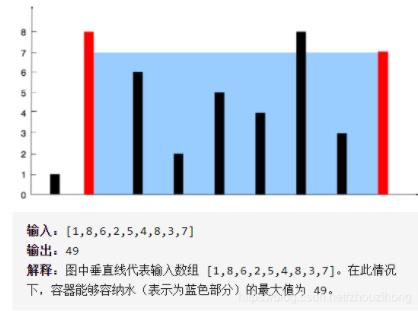

盛水最多的容器



详细思路

从容器的两个边界同时向中间夹，哪个短就夹哪个，每次都更新答案

精确定义

left是容器左边界

right是容器右边界

V是容器当前容量

ans是容器最大容量

```c
class Solution {
public:
    int maxArea(vector<int>& height) {
        int left=0,right=height.size()-1,V=0,ans=0;
        while(left<right){
            V=(right-left)*min(height[left],height[right]);
            ans=max(ans,V);
            if(height[left]<height[right])left++;
            else right--;
        }
        return ans;
    }
};
```

