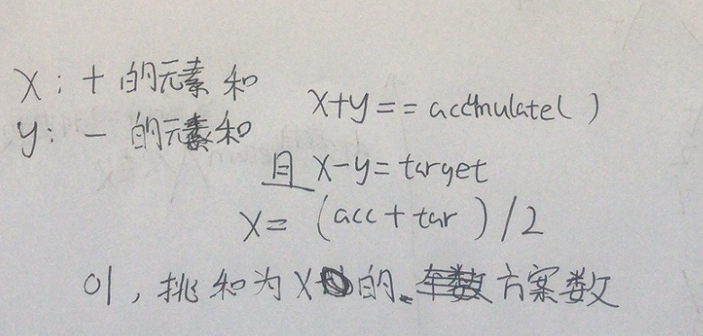

目标和


抽象图固定维护寻找

dfs搜索，递归，建议画图


```c
class Solution {
public:
    int findTargetSumWays(vector<int>& nums, int target) {

        return dfs(0,target,nums);
    }
    int dfs(int i,int target,vector<int>&nums){
        if(i==nums.size()){
            if(target==0)return 1; 
            return 0;
        }
        return dfs(i+1,target-nums[i],nums)+dfs(i+1,target+nums[i],nums);
    }
};

```


记忆化

```c
class Solution {
public:
    int findTargetSumWays(vector<int>& nums, int target) {
        map<pair<int,int>,int>memo;
        return dfs(0,target,memo,nums);
    }
    int dfs(int i,int target,map<pair<int,int>,int>&memo,vector<int>&nums){
        if(i==nums.size()){
            if(target==0){
                return 1;
            }
            return 0;
        }
        if(memo.count({i,target}))return memo[{i,target}];

        memo[{i,target}]=dfs(i+1,target-nums[i],memo,nums)+dfs(i+1,target+nums[i],memo,nums);
        return memo[{i,target}];
    }
};
```


不断挑选num，让target不断减少，很像01背包，挑选+，不管-



```c
class Solution {
public:
    int findTargetSumWays(vector<int>& nums, int target) {
        int acc=accumulate(nums.begin(),nums.end(),0);
        if(target>acc)return 0;
        if((target+acc)%2==1)return 0;
        int x=(acc+target)/2;
        if(x<0)return 0;
        vector<int>dp(x+1,0);
        dp[0]=1;
        for(int num:nums){
            for(int i=x;i>=0;i--){
                if(i-num>=0)dp[i]+=dp[i-num];
            }
        }
        return dp[x];
    }
};
```


0/1背包：外循环nums,内循环target,target逆序，易错，假如外循环是i，每个dpi遍历完只放入一个物品，假如i正序，只能使用1次的物品被使用多次

完全背包：外循环nums,内循环target,target正序

组合背包：外循环target,内循环nums,target正序