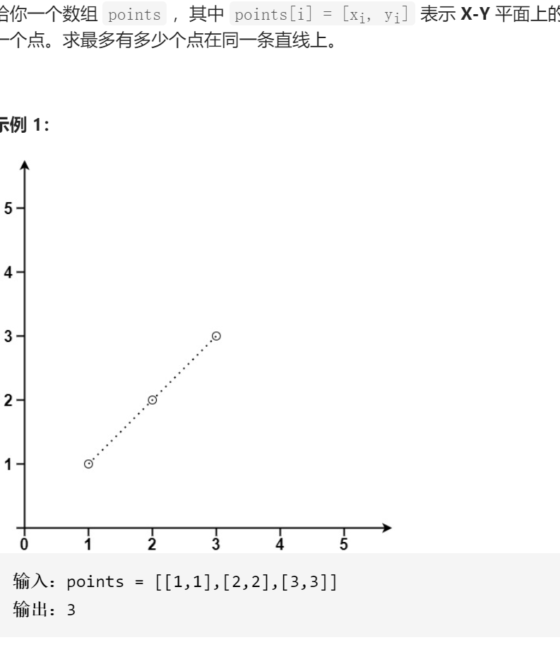

直线上最多的点数



变量简洁正确完整思路

对于i，建立i的哈希表k2cnt，从0查找j，对每个j与i的斜率k存放在哈希表中，有过就++没有过就=2，同时更新ans最大点数，当对于另一个i需要重新k2cnt来查找j并更新答案因为不同i与j不会在同一条直线

```c
class Solution {
public:
    int maxPoints(vector<vector<int>>& points) {
        int n=points.size();
        if(n==1)return 1;
        int ans=2;
        for(int i=0;i<n;i++){
            unordered_map<double,int>k2cnt;
            for(int j=0;j<n&&i!=j;j++){
                if(i==0)cout<<1<<endl;
                int dx=points[i][0]-points[j][0];
                int dy=points[i][1]-points[j][1];
                double k=(double)dy/dx;
                //cout<<i<<' '<<j<<' '<<k<<endl;
                if(k2cnt.count(k))k2cnt[k]++;
                else k2cnt[k]=2;
                ans=max(ans,k2cnt[k]);
            }
        }
        return ans;
    }
};

```

踩过的坑

double除以double 0，得到inf或-inf表示无穷大，计算`0.0/0.0`或`inf/inf`，结果将是`NaN，但是inf和-inf在哈希集都算作同一个`

```
for(int j=0;j<n&&i!=j;j++){千万小心，for（）里面的i!=j一旦发生for就结束了，没有余地不要这么做！！for条件判断就只是整个遍历结束的条件，而不是一次循环的结束多多cout不用担心
```

