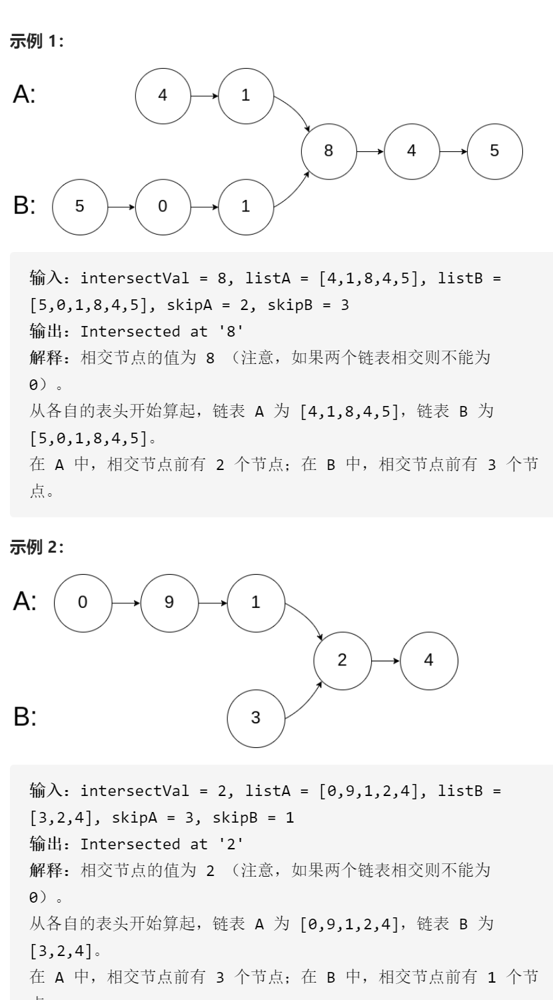

相交链表



变量简洁正确完整思路

cur1cur2指向headAheadB，同步走，一般，有相交，则cur1cur2一个到尾了一个还没有到，此时，到尾的去另一条链，继续同步，后来到尾的也去另一条链，则第二遍必定在交点相遇，因为第一遍，前部分未相交的一条如果多走了一步，则第二遍那条在交点处必定少走了一步，刚刚好

```c
class Solution {
public:
    ListNode *getIntersectionNode(ListNode *headA, ListNode *headB) {
        ListNode*cur1=headA,*cur2=headB;
        while(cur1!=cur2||!cur1&&!cur2){
            if(cur1)cur1=cur1->next;
            if(cur2)cur2=cur2->next;
            if(!cur1&&!cur2)break;
            if(!cur1)cur1=headB;
            if(!cur2)cur2=headA;
        }
        return cur1;
    }
};
```

