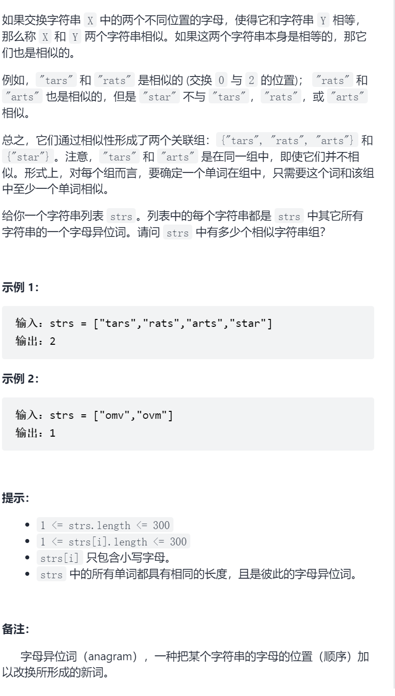
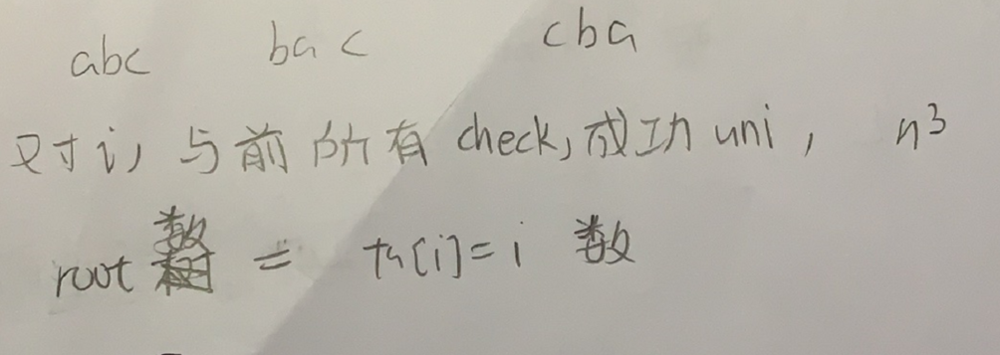

相似字符串组



抽象图一二ij



```c
#define maxn 305
class UF{
public:
    int fa[maxn],rank[maxn];
    UF(int n){
        for(int i=0;i<n;i++){
            fa[i]=i;
            rank[i]=1;
        }
    }
    int find(int x){
        return x==fa[x]?x:(fa[x]=find(fa[x]));
    }
    void uni(int i,int j){
        int x=find(i),y=find(j);
        if(rank[x]<=rank[y])fa[x]=y;
        else fa[y]=x;
        if(rank[x]==rank[y]&&x!=y)rank[y]++;
    }
    int getAns(int n){
        int ans=0;
        for(int i=0;i<n;i++){
            if(fa[i]==i)ans++;
        }
        return ans;
    }
};
class Solution {
public:
    int numSimilarGroups(vector<string>& strs) {
        int n=strs.size();
        UF uf(n);
        for(int i=0;i<n;i++){
            for(int j=0;j<i;j++){
                if(check(strs[i],strs[j])){
                    uf.uni(i,j);
                }
            }
        }
        int ans=uf.getAns(n);
        return ans;
    }
    bool check(string&a,string&b){
        int cnt=0;
        for(int i=0;i<a.size();i++){
            if(a[i]!=b[i])cnt++;
            if(cnt>2)return false;
        }
        return true;
    }
};
```

