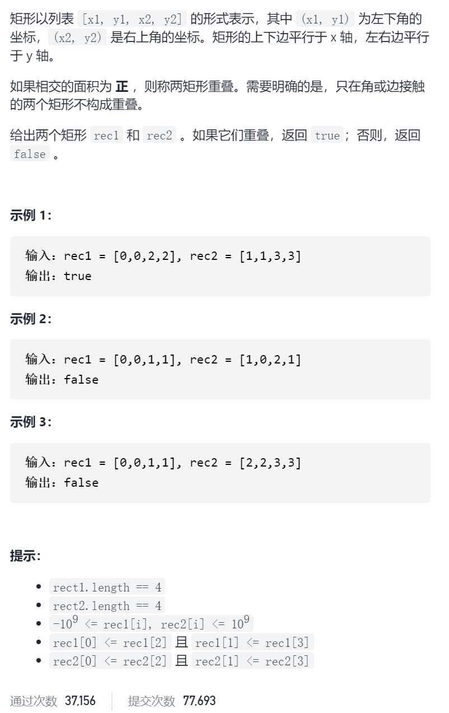
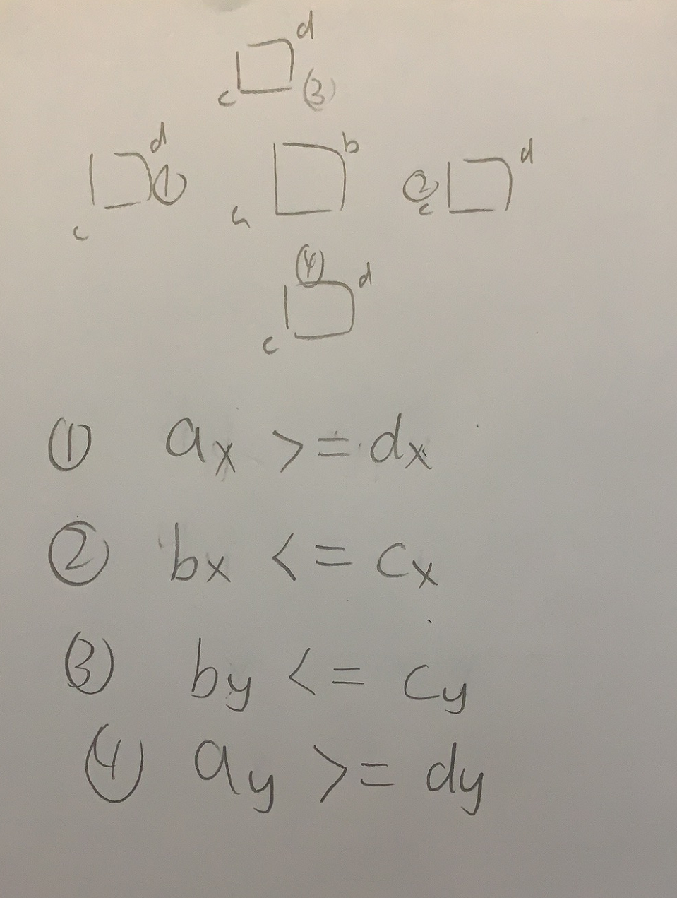

矩形重叠



抽象图一二ij



```c
class Solution {
public:
    bool isRectangleOverlap(vector<int>& rec1, vector<int>& rec2) {
        int ax=rec1[0],ay=rec1[1],bx=rec1[2],by=rec1[3];
        int cx=rec2[0],cy=rec2[1],dx=rec2[2],dy=rec2[3];
        if(ax>=dx||bx<=cx||by<=cy||ay>=dy)return false;
        return true;
    }
};
```

