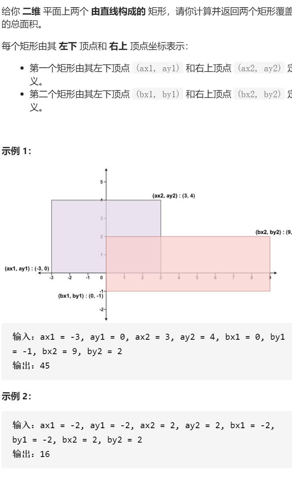

矩形面积

变量简洁正确完整思路

找出最小上，最大下，最大左，最小右updownleftright，交集sum=0或计算，ans=。。。

```c
class Solution {
public:
    int computeArea(int ax1, int ay1, int ax2, int ay2, int bx1, int by1, int bx2, int by2) {
        int up=min(ay2,by2),down=max(ay1,by1),left=max(ax1,bx1),right=min(ax2,bx2);
        int sum;
        if(left>=right||up<=down)sum=0;
        else sum=(up-down)*(right-left);
        return (ay2-ay1)*(ax2-ax1)+(by2-by1)*(bx2-bx1)-sum;
    }
};
```

