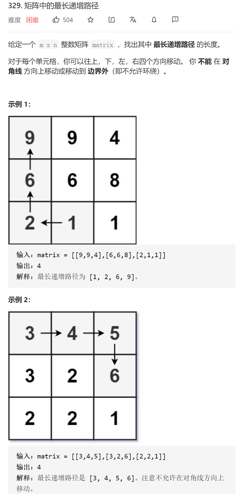

矩阵中的最长递增路径



变量简洁正确完整思路

错误示例：先dfs回溯，如果是大于等于就可以进入，记录len，vis，

但是！没有一个限定的长度，dfs开头没有return的机会，某些例子会无限循环！

这个时候就要用dfs记忆化搜索，凡是没有限定长度都不能用dfs回溯

```c
class Solution {
public:
    vector<vector<int>>vis;
    int ans=1;
    int xx[4]={1,-1,0,0},yy[4]={0,0,1,-1};
    int n,m;
    vector<vector<int>>matrix;
    int longestIncreasingPath(vector<vector<int>>& matrix) {
        n=matrix.size(),m=matrix[0].size();
        this->matrix=matrix;
        vis.resize(n,vector<int>(m,0));
        vector<int>ans1;
        for(int i=0;i<n;i++){
            for(int j=0;j<m;j++){
                vis[i][j]=1;
                ans1.push_back(matrix[i][j]);
                dfs(1,i,j,ans1);
                vis[i][j]=0;
                ans1.pop_back();
            }
        }
        return ans;
    }
    void dfs(int len,int x,int y,vector<int>ans1){
        
        for(int i=0;i<4;i++){
            int dx=xx[i]+x,dy=yy[i]+y;
            if(dx<0||dx>=n||dy<0||dy>=m||vis[dx][dy]||matrix[dx][dy]<=matrix[x][y])continue;
            ans=max(ans,len+1);
            vis[dx][dy]=1;
            ans1.push_back(matrix[dx][dy]);
            dfs(len+1,dx,dy,ans1);
            vis[dx][dy]=0;
            ans1.pop_back();
        }
    }
};
```

变量简洁正确完整思路

dfs回溯+备忘录，一般不会这么做，加了备忘录的记忆化搜索更加适合dfs有返回值的模板

否则你不要返回值会很麻烦在回溯上加上备忘录，这里我使用maxAns1在出口更新memo

并且在dfs内部memo有了就更新答案并continue，但是，dfs回溯并不适合没有明确边界

的题，所以某些例子会无限循环

```c
class Solution {
public:
    vector<vector<int>>vis;
    int ans=1;
    int xx[4]={1,-1,0,0},yy[4]={0,0,1,-1};
    int n,m;
    vector<vector<int>>matrix;
    vector<vector<int>>memo;
    int longestIncreasingPath(vector<vector<int>>& matrix) {
        n=matrix.size(),m=matrix[0].size();
        this->matrix=matrix;
        vis.resize(n,vector<int>(m,0));
        memo.resize(n,vector<int>(m,-1));
        vector<int>ans1;
        for(int i=0;i<n;i++){
            for(int j=0;j<m;j++){
                vis[i][j]=1;
                ans1.push_back(matrix[i][j]);
                int maxAns1=1;
                dfs(1,i,j,ans1,maxAns1);
                memo[i][j]=maxAns1;
                //cout<<i<<' '<<j<<' '<<maxAns1<<endl;
                vis[i][j]=0;
                ans1.pop_back();
            }
        }
        return ans;
    }
    void dfs(int len,int x,int y,vector<int>ans1,int& maxAns1){
        for(int i=0;i<4;i++){
            int dx=xx[i]+x,dy=yy[i]+y;
            //cout<<dx<<' '<<dy<<' '<<' '<<len<<endl;
            if(dx<0||dx>=n||dy<0||dy>=m||vis[dx][dy]||matrix[dx][dy]<=ans1.back())continue;
            //cout<<len+1<<endl;
            //cout<<dx<<' '<<dy<<' '<<len<<' '<<matrix[dx][dy]<<endl;
            if(memo[dx][dy]!=-1){
                ans=max(ans,memo[dx][dy]+len);
                maxAns1=max(maxAns1,memo[dx][dy]+len);
                continue;
            }
            maxAns1=max(maxAns1,len+1);
            ans=max(ans,len+1);
            vis[dx][dy]=1;
            ans1.push_back(matrix[dx][dy]);
            dfs(len+1,dx,dy,ans1,maxAns1);
            vis[dx][dy]=0;
            ans1.pop_back();
        }
    }
};
```


变量简洁正确完整思路

dfs回溯无返回值，入口处处理好并dfs不断进进退退找到最好的更新全局变量，

但是这道题可以dfs记忆化搜索，记忆化搜索有返回值，要有递归的思想，返回值就是

从xy开始最长路径的长度，记忆化搜索与回溯的不同点之一在于记忆化搜索常常xy是需要

处理的，而回溯是已经处理好的，记忆化搜索不需要vis而回溯需要，记忆化搜索有返回值

而回溯不需要，在dfs函数体开头判断，dfs，形参beg表示已经弄了beg-1，

需要处理beg，xy，返回xy起点的最大值

```c
class Solution {
public:
    int n,m;
    vector<vector<int>>matrix;
    vector<vector<int>>memo;
    int xx[4]={1,-1,0,0},yy[4]={0,0,1,-1};
    int longestIncreasingPath(vector<vector<int>>& matrix) {
        n=matrix.size(),m=matrix[0].size();
        this->matrix=matrix;
        memo.resize(n,vector<int>(m,0));
        int ans=0;
        for(int i=0;i<n;i++){
            for(int j=0;j<m;j++){
                ans=max(ans,dfs(i,j));
            }
        }
        return ans;
    }
    int dfs(int x,int y){
        if(memo[x][y]!=0)return memo[x][y];
        memo[x][y]++;
        for(int i=0;i<4;i++){
            int dx=xx[i]+x,dy=yy[i]+y;
            if(dx<0||dx>=n||dy<0||dy>=m||matrix[dx][dy]<=matrix[x][y])continue;
            memo[x][y]=max(memo[x][y],dfs(dx,dy)+1);
            
        }
        return memo[x][y];
    }
};
```

