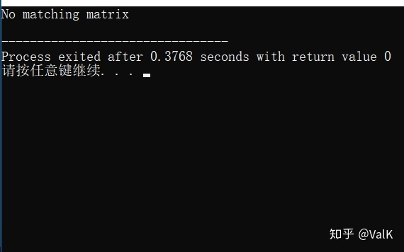

文章的标题图里面显示的matrix类是openCV里面的matrix类的源代码，这个类在openCV的神经网络库里面发挥了至关重要的作用。不过今天我们要做的任务不是吃透openCV的matrix代码，而是直接着手去实现一个Matrix类，并且封装一些必要的函数，重载一些必要的运算符。这些操作只需要基础的C++知识即可。

首先是Matrix成员的设计，我们设计Matrix的时候要考虑到几点：Matrix的必需参数，Matrix的数据存储区，以及Matrix支持的数据类型。

很明显，Matrix包括行数row，列数col，一个支持任意数据类型的**num二维指针。为了支持任意数据类型，使用template来实现。

首先写出大体框架，考虑到我们需要一些基础功能，尤其是运算功能和数据寻找功能，所以我们大致确定需要重载的各种运算符。

```cpp
template<typename __T>
class Matrix
{
private:
	int row;
	int col;
	__T **num;
public:
	Matrix(const int,const int);
	Matrix(const Matrix<__T>&);
	~Matrix();
	Matrix  operator+ (const Matrix<__T>&);
	Matrix  operator- (const Matrix<__T>&);
	Matrix  operator* (const Matrix<__T>&);
	Matrix& operator= (const Matrix<__T>&);
	__T*    operator[](const int);
	Matrix  Hadamard  (const Matrix<__T>&);
	Matrix  Transpose ();
	template<typename T> friend std::ostream& operator<<(std::ostream&,const Matrix<T>&);
	template<typename T> friend std::istream& operator>>(std::istream&,const Matrix<T>&);
};

template<typename __T>
Matrix<__T>::Matrix(const int __row,const int __col)
{
	row=__row;
	col=__col;
	if(row>0 && col>0)
	{
		num=new __T* [row];
		for(int i=0;i<row;++i)
			num[i]=new __T[col];
	}
	else
	{
		row=0;
		col=0;
		num=NULL;
	}
	return;
}

template<typename __T>
Matrix<__T>::Matrix(const Matrix<__T>& __temp)
{
	row=__temp.row;
	col=__temp.col;
	if(row>0 && col>0)
	{
		num=new __T* [row];
		for(int i=0;i<row;++i)
			num[i]=new __T[col];
		for(int i=0;i<row;++i)
			for(int j=0;j<col;++j)
				num[i][j]=__temp.num[i][j];
	}
	else
	{
		row=0;
		col=0;
		num=NULL;
	}
	return;
}

template<typename __T>
Matrix<__T>::~Matrix()
{
	if(num)
	{
		for(int i=0;i<row;++i)
			delete[] num[i];
		delete []num;
	}
	return;
}
```

首先是构造函数和拷贝构造函数，为了照顾定义对象数组时可能出现的没有初始化参数的情况，构造函数中默认num为NULL。拷贝构造函数则是单纯的复制数据创造新对象。析构函数很简单，就是释放二维指针指向的所有空间，前提是num不为NULL。

接下来是实现最简单的两个运算符，+和-。要使得+和-运算符可工作，首先两边的对象必须row和col值都相同才行，这个条件在Hadamard乘积函数里也有提及。

+和-的运作就是对应的矩阵里的数进行+和-。不过为了防止真的出现不符合条件的运算符调用，我还特地加入了throw机制来提醒出错，throw出的字符串可以被catch到。

```cpp
template<typename __T>
Matrix<__T> Matrix<__T>::operator+(const Matrix<__T>& B)
{
	if(this->row==B.row&&this->col==B.col)
	{
		for(int i=0;i<row;++i)
			for(int j=0;j<col;++j)
				this->num[i][j]+=B.num[i][j];
		return *this;
	}
	else
	{
		Matrix<__T> NullMatrix(0,0);
		std::string WarningInformation="No matching matrix";
		throw WarningInformation;
		return NullMatrix;
	}
}

template<typename __T>
Matrix<__T> Matrix<__T>::operator-(const Matrix<__T>& B)
{
	if(this->row==B.row&&this->col==B.col)
	{
		for(int i=0;i<row;++i)
			for(int j=0;j<col;++j)
				this->num[i][j]-=B.num[i][j];
		return *this;
	}
	else
	{
		Matrix<__T> NullMatrix(0,0);
		std::string WarningInformation="No matching matrix";
		throw WarningInformation;
		return NullMatrix;
	}
}
```

接下来是=运算符的重载。=运算符重载的传参必须是const型，否则编译器报错。

```cpp
template<typename __T>
Matrix<__T>& Matrix<__T>::operator=(const Matrix<__T>& B)
{
	if(num)
	{
		for(int i=0;i<row;++i)
			delete[] num[i];
		delete num;
	}
	row=B.row;
	col=B.col;
	if(row>0 && col>0)
	{
		num=new __T* [row];
		for(int i=0;i<row;++i)
			num[i]=new __T[col];
		for(int i=0;i<row;++i)
			for(int j=0;j<col;++j)
				num[i][j]=B.num[i][j];
	}
	else
	{
		row=0;
		col=0;
		num=NULL;
	}
	return *this;
}
```

由于是直接对左侧*this操作的，所以在复制之前先确认num是否已经指向一块内存，如果指向了，那么就释放这个内存重新申请。

如果operator=是void类型返回，那么这个运算符是不能完成这个语句的：

```cpp
a=b=c;
```

所以使用Matrix &，因为使用引用一方面可以使得上面这个语句行得通，而且效率也比较高。

重载[]可以使用代理类（感谢评论区小伙伴的提醒，一年前忘了实现这个），考虑到简易写法，先在这里实现一个不使用代理类的直接方法，但是这个方法在实际使用中如果使用不当，可能会导致野指针的出现，所以之后会继续增加代理类写法：

```cpp
template<typename __T>
__T* Matrix<__T>::operator[](const int addr)
{
	return addr>=this->row? NULL:this->num[addr];
}
```

接下来是流运算符<<和>>的重载。流运算符的重载都是通过friend友元函数重载的，写法大致如下：

类内部声明：

```cpp
template<typename T> friend std::ostream& operator<<(std::ostream&,const Matrix<T>&);
template<typename T> friend std::istream& operator>>(std::istream&,const Matrix<T>&);
```

外部：

```cpp
template<typename T>
std::ostream& operator<<(std::ostream& strm,const Matrix<T>& aim)
{
	for(int i=0;i<aim.row;++i)
	{
		for(int j=0;j<aim.col;++j)
			strm<<aim.num[i][j]<<((char)(j==aim.col-1)? '\n':' ');
	}
	return strm;
}

template<typename T>
std::istream& operator>>(std::istream& strm,const Matrix<T>& aim)
{
	for(int i=0;i<aim.row;++i)
		for(int j=0;j<aim.col;++j)
			strm>>aim.num[i][j];
	return strm;
}
```

外部友元的template函数的typename千万要避免和class的template里面的typename重名。

接下来三个功能都是重头戏，在神经网络的前向过程和反向传播中都缺少不了这些功能。

1.重载运算符*

2.矩阵转置Transpose

3.矩阵Hadamard乘积（在LSTM中有提及）

由于template的特殊性，而后面两个功能的传出类型是Matrix，所以也必须是一个template函数，故这次我也把这两个功能写成了友元函数。重载运算符*则直接写在类中。

运算符*的条件也很明显，两侧的row和col必须不为0，且左侧的col必须等于右侧的row，否则运算无法进行，会throw出一个错误提示字符串，可被catch。

过程按照矩阵乘法来即可，左侧第n行的向量与右侧第m列的向量点乘得到一个数值，放入新创建的temp.num[n][m]中。

```cpp
template<typename __T>
Matrix<__T> Matrix<__T>::operator*(const Matrix<__T>& B)
{
	Matrix<__T> NullMatrix(0,0);
	if(!this->row || !this->col|| !B.row|| !B.col)
	{
		std::string WarningInformation="No matching matrix";
		throw WarningInformation;
	}
	else if(this->col!=B.row)
	{
		std::string WarningInformation="No matching matrix";
		throw WarningInformation;
	}
	else
	{
		Matrix<__T> Temp(this->row,B.col);
		__T trans;
		for(int i=0;i<Temp.row;++i)
			for(int j=0;j<Temp.col;++j)
			{
				trans=0;
				for(int k=0;k<this->col;++k)
					trans+=this->num[i][k]*B.num[k][j];
				Temp.num[i][j]=trans;
			}
		return Temp;
	}
	return NullMatrix;
}
```

Hadamard乘积则比较好理解，条件是左右两侧的矩阵row和col必须分别相同，否则运算无法进行。其运算规则就是左侧的num[i][j]乘右侧的num[i][j]得到的数值填入新创建的Temp.num[i][j]中。

Transpose转置就是将传入的矩阵的row作为新矩阵的col，col作为新矩阵的row，然后新创建的Temp.num[i][j]=B.num[j][i]，就是这么简单粗暴。

```cpp
template<typename T>
friend Matrix<T> Hadamard(const Matrix<T> &A,const Matrix<T> &B);
template<typename T>
friend Matrix<T> Transpose(const Matrix<T> &B);
//in class Matrix

template<typename T>
Matrix<T> Hadamard(const Matrix<T> &A,const Matrix<T> &B)
{
	if(!A.row||!A.col||!B.row||!B.col)
	{
		Matrix<T> NullMatrix(0,0);
		std::string WarningInformation="No matching matrix";
		throw WarningInformation;
		return NullMatrix;
	}
	else if(A.row!=B.row||A.col!=B.col)
	{
		Matrix<T> NullMatrix(0,0);
		std::string WarningInformation="No matching matrix";
		throw WarningInformation;
		return NullMatrix;
	}
	else
	{
		Matrix<T> Temp(A.row,A.col);
		for(int i=0;i<A.row;++i)
			for(int j=0;j<A.col;++j)
				Temp.num[i][j]=A.num[i][j]*B.num[i][j];
		return Temp;
	}
}

template<typename T>
Matrix<T> Transpose(const Matrix<T> &B)
{
	Matrix<T> temp(B.col,B.row);
	for(int i=0;i<B.row;++i)
		for(int j=0;j<B.col;++j)
			temp.num[j][i]=B.num[i][j];
	return temp;
}
//out of the class Matrix
```

不过这种通过友元函数的写法有一个比较麻烦的地方，就是和流运算符结合的时候，编译器会犯难。

例如：

```cpp
Matrix<double> a(2,3);
std::cout<<Transpose(a);
```

这时编译器会告诉你：

```cpp
[Error] no match for 'operator<<' (operand types are 
'std::ostream {aka std::basic_ostream<char>}' and 'Matrix<double>')
```

但是如果你写成这样：

```cpp
Matrix<double> a(2,3);
a=Transpose(a);
std::cout<<a;
```

那么就一点问题都没有了……Hadamard同理。

然而我们可以用正规的写法来避免这种新手会遇到的困难,这是一个不使用友元函数的方法，在这个方法中，两个函数的传参数量会有所改变：

```cpp
template<typename __T>
Matrix<__T> Matrix<__T>::Hadamard(const Matrix<__T>& B)
{
	Matrix<__T> NullMatrix(0,0);
	if(!this->row || !this->col || !B.row || !B.col)
	{
		std::string WarningInformation="No matching matrix";
		throw WarningInformation;
	}
	else if(this->row!=B.row || this->col!=B.col)
	{
		std::string WarningInformation="No matching matrix";
		throw WarningInformation;
	}
	else
	{
		Matrix<__T> temp(this->row,this->col);
		for(int i=0;i<this->row;++i)
			for(int j=0;j<this->col;++j)
				temp.num[i][j]=this->num[i][j]*B.num[i][j];
		return temp;
	}
	return NullMatrix;
}

template<typename __T>
Matrix<__T> Matrix<__T>::Transpose()
{
	Matrix<__T> temp(this->col,this->row);
	for(int i=0;i<this->row;++i)
		for(int j=0;j<this->col;++j)
			temp.num[j][i]=this->num[i][j];
	return temp;
}
```

那么我们就完成了一个简易的Matrix实现。

至于如何catch到报错信息，参考下方代码：

```cpp
Matrix<double> a(1,1);
Matrix<double> b(2,3);
Matrix<double> c;
try
{
    c=a+b;//Error
}
catch(std::string WarningInformation)
{
    std::cout<<WarningInformation<<std::endl;
}
```

然后你就会得到：

