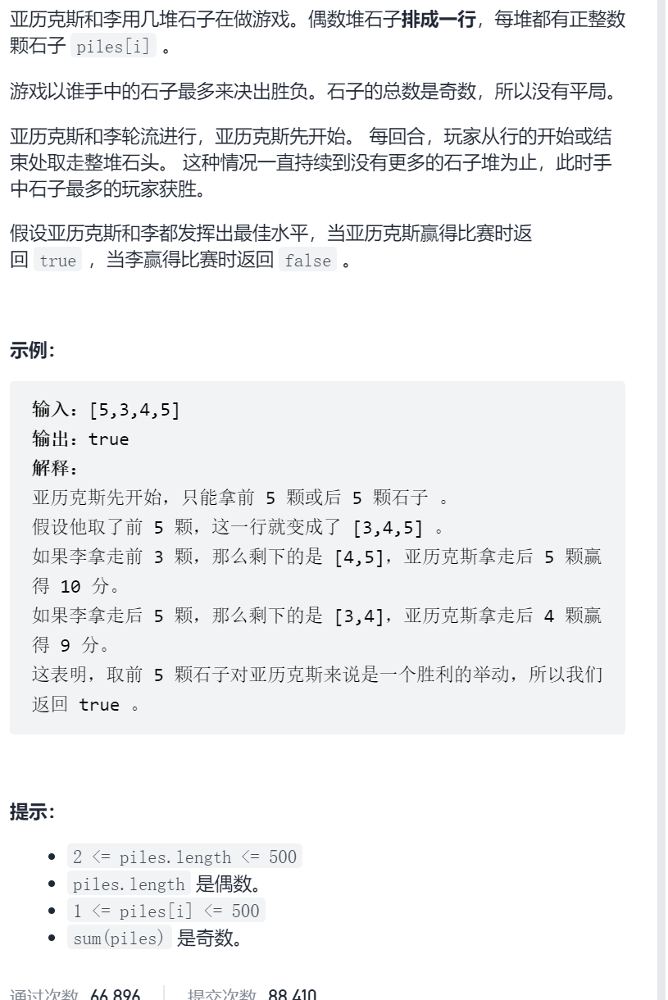
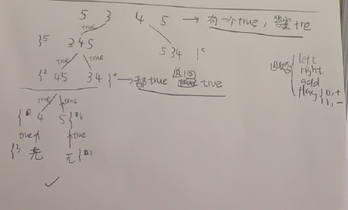
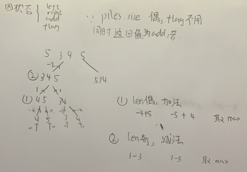

石子游戏

抽象图一二ij



```c

class Solution {
public:
    bool stoneGame(vector<int>& piles) {
        int n=piles.size();
        bool leftDfs=dfs(1,n-1,piles[0],true,piles);
        bool rightDfs=dfs(0,n-2,piles[n-1],true,piles);
        return leftDfs||rightDfs;
    }
    bool dfs(int left,int right,int add,bool flag,vector<int>&piles){
        if(left>right){
            if(add>0)return true;
            return false;
        }
        if(flag==false){
            bool leftDfs=dfs(left+1,right,add+piles[left],true,piles);
            bool rightDfs=dfs(left,right-1,add+piles[right],true,piles);
            return left&&right;
        }else {
            bool leftDfs=dfs(left+1,right,add-piles[left],false,piles);
            bool rightDfs=dfs(left,right-1,add-piles[right],false,piles);
            return leftDfs&&rightDfs;
        }
    }
};

```



```c
class Solution {
public:
    bool stoneGame(vector<int>& piles) {
        int n=piles.size();
        vector<vector<int>>memo(n,vector<int>(n,INT_MIN));
        return dfs(0,n-1,piles,memo)>0;
    }
    int dfs(int left,int right,vector<int>&piles,vector<vector<int>>&memo){
        int n=right-left+1;
        if(left>right)return 0;
        if(memo[left][right]!=INT_MIN)return memo[left][right];
        int leftAdd=dfs(left+1,right,piles,memo);
        int rightAdd=dfs(left,right-1,piles,memo);
        int ans=0;
        if(n%2==0){
            ans=max(leftAdd+piles[left],rightAdd+piles[right]);
        }else {
            ans=max(leftAdd-piles[left],rightAdd-piles[right]);
        }
        memo[left][right]=ans;
        return ans;
    }
};
```

