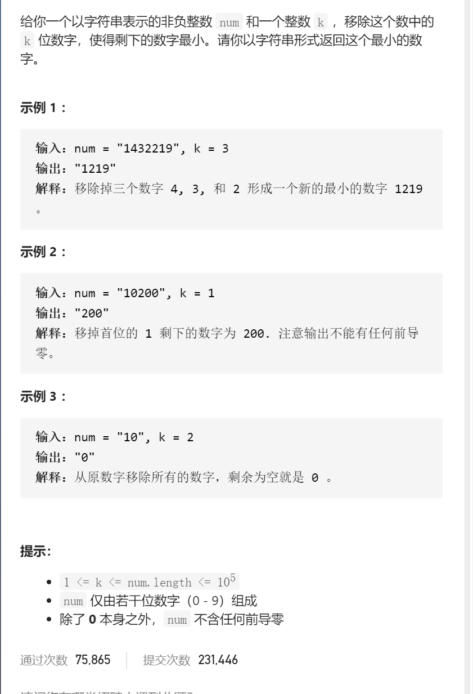

移掉K位数字



变量简洁正确完整思路

1 4 3 2 2 1 9 单调栈，栈内为1 4，遇到3，移除掉4，栈内为1 3 ，遇到2，移除掉3，栈内为1 2 ，为1 2 2，遇到1，移除掉2（k==0，不能继续移除），栈内为1 2 1 9，先写框架


```c
class Solution {
public:
    string removeKdigits(string num, int k) {
        string que;
        for(int i=0;i<num.size();i++){
            while(!que.empty()&&que.back()>num[i]&&k>0){
                que.pop_back();
                k--;
            }
            que.push_back(num[i]);
        }
        return que;

    }
};
```

处理细节

```c
class Solution {
public:
    string removeKdigits(string num, int k) {
        string que;
        for(int i=0;i<num.size();i++){
            while(!que.empty()&&que.back()>num[i]&&k>0){
                que.pop_back();
                k--;
            }
            if(num.size()-i>k)que.push_back(num[i]);
            else k--;
        }
        int i=0;
        while(que[i]=='0')i++;
        que=que.substr(i);
        if(que.empty())return "0";
        return que;

    }
};
```

