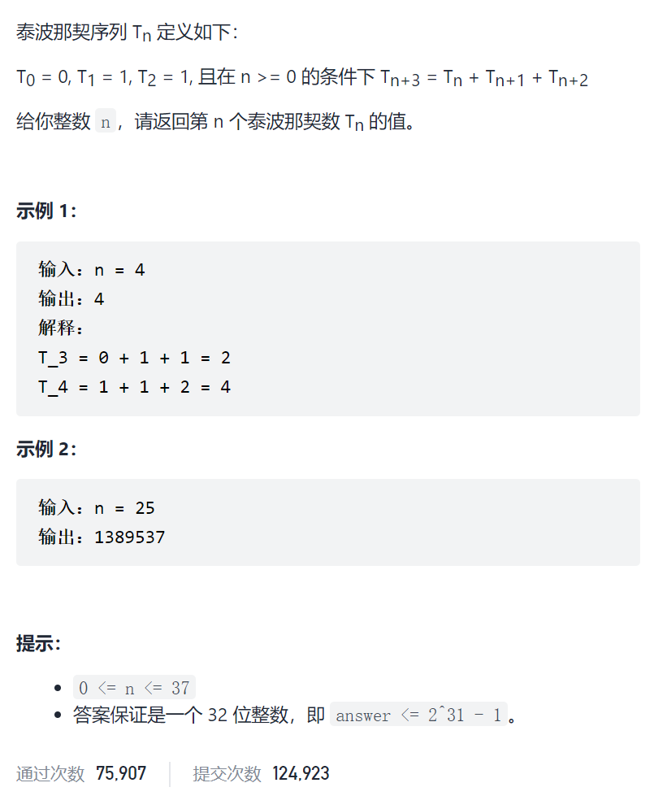

第N个泰波那契数



```c
class Solution {
public:
    int tribonacci(int n) {
        int Tn=0,Tn1=1,Tn2=1;
        if(n==0)return Tn;
        else if(n==1)return Tn1;
        else if(n==2)return Tn2;
        int Tn3;
        for(int i=3;i<=n;i++){
            Tn3=Tn+Tn1+Tn2;
            Tn=Tn1;
            Tn1=Tn2;
            Tn2=Tn3;
        }
        return Tn3;
    }
};
```

矩阵快速幂

https://mp.weixin.qq.com/s?__biz=MzU4NDE3MTEyMA==&mid=2247488198&idx=1&sn=8272ca6b0ef6530413da4a270abb68bc&chksm=fd9cb9d9caeb30cf6c2defab0f5204adc158969d64418916e306f6bf50ae0c38518d4e4ba146&token=1067450240&lang=zh_CN#rd