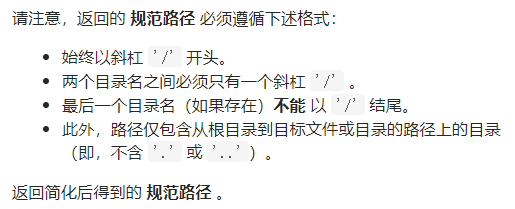

简化路径



详细思路

将输入存储在stringstream流，读取字符直到/并存放在cur，需要判断cur，如果是空或者.跳过，如果是..而ans不为空pop，如果是其余就放到ans表示文件名

精确定义

cur需要判断的字符串

ans已经处理好的文件名

```c
class Solution {
public:
    string simplifyPath(string path) {
        stringstream ss(path);
        string cur;
        vector<string>ans;
        while(getline(ss,cur,'/')){
            if(cur==""||cur==".")continue;
            else if(cur==".."&&!ans.empty())ans.pop_back();
            else {
                if(cur=="..")continue;
                ans.push_back(cur);
            }
        }
        string s;
        if(ans.empty())return "/";
        for(auto str:ans){
            s.push_back('/');
            s+=str;
        }
        return s;
    }
};
```


踩过的坑

getline函数（流，接受的变量名，在该字符之前停止读取）默认读取直到遇到换行符，可读取空格，

getline(ss,cur,'/')