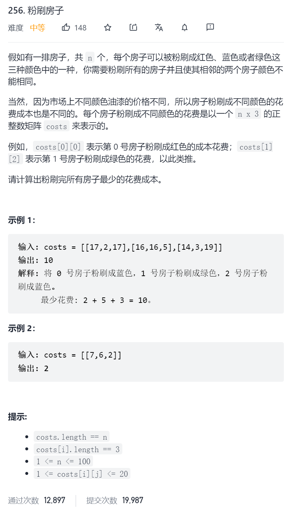

概述
对于那些已经熟悉记忆化和动态变成的人来说，这个问题很简单。对于那些刚刚开始编写 Leetcode 的人来说，它是一个难题。对于刚刚开始学习动态规划和记忆化的人来说，这个问题是一个很好的开始！

本文针对的是那些刚刚开始学习动态规划和记忆化的人。我假设您已经学习了一些必要的概念，如 N 叉树或二叉树 ，包括递归。如果没有，那么强烈建议你在学习完 N 叉树和二叉树后再回到这个问题。记忆化和动态规划背后的思想是利用树来理解的。了解如何识别并处理记忆化和动态规划问题是面试成功的关键。

方法一：暴力法
暴力法往往是一个很好的开始。从暴力法可以确定不必要的工作和进一步优化。在这种情况下，暴力法将生成每一个有效房屋颜色的排列并计算它的花费。最后得到最低的花费就是我们想要的结果。

在本文中，我们将使用以下输入作为示例：

[[17, 2, 17], [8, 4, 10], [6, 3, 19], [4, 8, 12]]

下面是该房子的有效排列。总共 24 个，圈起来的是花费最低的。

最好的选择是把第一栋房子涂成绿色，第二栋房子涂成红色，第三栋房子涂成绿色，第四栋房子涂成红色。总共花费 17。

算法：

暴力法在实践中是完全不可行和无用的，因此这里我没有包括它的代码。你也不会在面试中为它编写代码。相反你只需要描述一种可能的方法并优化，然后为一个更优化的算法编写代码。

有很多种不同的方法。它们都是基于生成排列。但有些只生成遵循颜色规则的排列，而另一些生成所有排列，然后删除无效的排列。有些是递归的，有些是迭代的。有些使用 O(n)O(n) 的空间，一次只生成一个排列，然后在生成下一个排列之前对其进行处理。而另一些则先生成所有排列，然后再对其进行处理。

最简单的方法是生成长度为 n 的 0，1，2 的每个可能的字符串，再删除任何连续出现两次具有相同数字的字符串，然后再对剩下的字符串进行计算成本。跟踪到目前为止遇到的最小成本。

复杂度分析

时间复杂度：O(2^n)O(2 
n
 ) 或 O(3^n)O(3 
n
 )。不用写代码，我们就能知道开销。我们至少需要处理每一个有效的排列。有效排列的数量，每增加一个房子，就变成两倍。共 4 个房子，有 24 个排列。如果我们再加上一个房子，则得到 48 个排列。因为每增加一个都会翻倍，这是 O(2^n)O(2 
n
 )。如果我们生成所有派略，然后再删除无效的排列，这样会有 O(3^n)O(3 
n
 ) 这样的排列。
空间复杂度：在范围 O(n)O(n) 到 O(n \cdot 3^n)O(n⋅3 
n
 ) 之间。这完全取决于执行情况。如果同时生成所有排列并将它们放入一个大列表中，那么你将使用 O(n * 2^n)O(n∗2 
n
 ) 或 O(n * 3^n)O(n∗3 
n
 ) 的空间。如果生成一个便处理，不保留长列表，他将需要 O(n)O(n) 的空间。
方法二：
和第一种方法一样，这种方法仍然不够好，但它弥补了方法 1 和方法 3 之间的差距，方法 3 在此基础上做了进一步优化。所以一定要理解清楚。

当我们进行排列时，可以把所有选项看作一颗大树。通过将而排列绘制成一颗树，在上面探索其他可能的算法。我们将继续使用上面的示例：

我们用一颗树来表示它，从根到叶的每一条路径都代表着不同的房子颜色的可能排列。树上有 24 个叶节点，就和暴力法中的 24 个排列一样。

树表示给出了问题所有可能排列的模型。它表明如果我们将第一栋房子涂成红色，那么第二个房子有两个选项：绿色或者蓝色。如果我们选择绿色作为第二栋房子，我们可以选择红色或者蓝色作为第三栋房子。等等

我们先不担心如何实现它，我们先探索一个简单的算法通过这棵树来解决这个问题。

如果前三栋房子是红色，绿色和红色的，那么我们可以把第四栋房子涂成绿色或者蓝色。我们要选择哪一个？

为了降低成本，我们选择绿色。这是因为绿色成本是 8，蓝色是 12。假设我们已经决定了前三栋房子是红，绿，红。

接下来我们要做的事判断红，绿，红，绿或红，绿，红，蓝哪个成本更低。因为前者成本更低，我们排除后者。我们可以用新的信息来简化我们的树。

我们可以按照相同的过程重复删除叶节点，如以下动画所示：
<,,,,,,,,,,,,,,,,,,,,,,,,,,>

我们的结论是：

把第一栋房子刷成红色总共要花费 34。
把第一栋房子刷成绿色总共要花费 17。
把第一栋房子漆成蓝色总共要花费 32。
所以把第一栋房子涂成绿色能够得到最小的成本，17。这与我们在暴力法中得到的答案一致。

算法：

我们要做的是一个自下而上的算法，这意味着我们要从处理叶节点开始，然后逐步向上。但是，当我们实际实现时，我们是自上而下的执行，使得我们带有递归的隐式树，而不是实际生成一个树。递归调用都形成树形结构。如果你不太理解这个点，不用惊慌，在下一节中有算法和动画。了解递归的最好方法就是看例子和理解常见模式。

我们开始吧。还记得我们是如何确定树上每间房子的成本的吗？

我们说的总成本，是指对房子进行某一特定颜色涂漆，并以最佳方式涂漆的成本。

在伪代码中，自上而下递归算法如下所示：

print min(paint(0, 0), paint(0, 1), paint(0, 2))

define function paint(n, color):
  total_cost = costs[n][color]
  if n is the last house number:
    pass [go straight to the return]
  else if color is red (0):
    total_cost += min(paint(n+1, 1), paint(n+1, 2))
  else if color is green (1):
    total_cost += min(paint(n+1, 0), paint(n+1, 2))
  else if color is blue (2):
    total_cost += min(paint(n+1, 0), paint(n+1, 1))
  return the total_cost    
下面是算法的动画，它还显示了递归调用在如何在不实际构建树的情况下，创建与我们前面相同的树结构。如果你不太理解递归，那么这个算法会让你感到困惑，不过这对于理解方法三是必要的。

1 / 34

下面的代码当你在阅读的适合，先思考如何优化它，使它不再有指数的时间。提示：仔细观察递归函数的参数。

PythonJava

def minCost(self, costs):
    """
    :type costs: List[List[int]]
    :rtype: int
    """

    def paint_cost(n, color):
        total_cost = costs[n][color]
        if n == len(costs) - 1:
            pass
        elif color == 0: # Red
            total_cost += min(paint_cost(n + 1, 1), paint_cost(n + 1, 2))
        elif color == 1: # Green
            total_cost += min(paint_cost(n + 1, 0), paint_cost(n + 1, 2))
        else: # Blue
            total_cost += min(paint_cost(n + 1, 0), paint_cost(n + 1, 1))
        return total_cost
    
    if costs == []:
        return 0
    return min(paint_cost(0, 0), paint_cost(0, 1), paint_cost(0, 2))
复杂度分析

时间复杂度：O(2^n)O(2 
n
 )。虽然此方法是对方法一的改进，但仍然需要指数的时间。
空间复杂度：O(n)O(n)。这个算法最初可能是 O(1)O(1)，因为我们没有分配任何数据结构。但是，我们需要考虑运行时堆栈的空间使用情况。每当我们处理最后一个房屋（房屋编号 n-1）时，堆栈上有 n 个堆栈帧。这种空间使用量对复杂性分析很重要，也是内存使用量，因此时间复杂性是 O(n)O(n)。
方法三：记忆化
这是我们移除任何层之前的树。

叶节点中所有的红房子花费 4，绿房子花费 7，蓝房子花费 23。这是因为第四栋房子涂成红，绿，蓝的成本分别为 4，7 和 23。

但是看看当我们按照方法 2 描述的方式移除这些叶节点时会发生什么。

同样，所有的红房子都是 14，绿房子是 7，蓝房子是 23。为什么会这样？把第三栋房子涂成红色总共要花费 6。然后我们要在第四栋房子的绿色和蓝色之间选择，由于绿色是 8，而蓝色是 12，因此所有的这些分治都变成了 6 + 8 = 14。因此类推。

下面是我们再移除一层的树。

不出所料，模式仍然存在，我们实际上是在一遍一遍的做相同的几个计算。我们应该尽可能的保存和重用结果，而不是重复进行同样的计算。

例如，如果你在学校布置了这个数学作业并且不允许使用计算器，你会怎么做？

1) 345 * 282 = ?
2) 43 + (345 * 282) = ?
3) (345 * 282) + 89 = ?
4) (345 * 282) * 5 + 19 = ?
除非你真的很喜欢算术，否则我觉得你只会做一次 345 * 282 的运算，然后把他插入到其他方程中。

计算这些房子粉刷的费用也是一样的。我们只需要计算第二栋房子刷红色的成本。

为此，我们记录计算过的值，写入到字典中，其中输入值作为键，返回值为结果。然后在函数开始时，我们将首先检查答案是否在字典中。如果是，我们可以立即得到答案，如果没有则进行计算。

算法：

算法几乎和方法二一样，唯一的区别就是，我们在开始时创建一个空字典，将计算的结果插入到字典中，然后通过字典查询是否已经计算过，若有则直接得到结果。

print min(paint(0, 0), paint(0, 1), paint(0, 2))

memo = a new, empty dictionary

define function paint(n, color):
  if (n, color) is a key in memo:
     return memo[(n, color)]
  total_cost = costs[n][color]
  if n is the last house number:
    pass [go straight to return]
  else if color is red (0):
    total_cost += min(paint(n+1, 1), paint(n+1, 2))
  else if color is green (1):
    total_cost += min(paint(n+1, 0), paint(n+1, 2))
  else if color is blue (2):
    total_cost += min(paint(n+1, 0), paint(n+1, 1))
  memo[(n, color)] = total_cost
  return the total_cost    
下图表示，较亮的圈圈表示实际计算答案的位置，而较暗的位置表示在字典中查找答案的位置。

PythonJava

def minCost(self, costs):
    """
    :type costs: List[List[int]]
    :rtype: int
    """

    def paint_cost(n, color):
        if (n, color) in self.memo:
            return self.memo[(n, color)]
        total_cost = costs[n][color]
        if n == len(costs) - 1:
            pass
        elif color == 0:
            total_cost += min(paint_cost(n + 1, 1), paint_cost(n + 1, 2))
        elif color == 1:
            total_cost += min(paint_cost(n + 1, 0), paint_cost(n + 1, 2))
        else:
            total_cost += min(paint_cost(n + 1, 0), paint_cost(n + 1, 1))
        self.memo[(n, color)] = total_cost
        return total_cost
    
    if costs == []:
        return 0
    
    self.memo = {}
    return min(paint_cost(0, 0), paint_cost(0, 1), paint_cost(0, 2))
在 Python 中，我们可以使用 functools 包中的 lru_cache。如果你不熟悉这个可以在 Python 中的文档中找到它。非常有用！

这是使用它的代码。

Python

from functools import lru_cache

class Solution:
    def minCost(self, costs):
        """
        :type costs: List[List[int]]
        :rtype: int
        """

        @lru_cache(maxsize=None)
        def paint_cost(n, color):
            total_cost = costs[n][color]
            if n == len(costs) - 1:
                pass
            elif color == 0:
                total_cost += min(paint_cost(n + 1, 1), paint_cost(n + 1, 2))
            elif color == 1:
                total_cost += min(paint_cost(n + 1, 0), paint_cost(n + 1, 2))
            else:
                total_cost += min(paint_cost(n + 1, 0), paint_cost(n + 1, 1))
            return total_cost
    
        if costs == []:
            return 0
        return min(paint_cost(0, 0), paint_cost(0, 1), paint_cost(0, 2))
复杂度分析

时间复杂度：O(n)O(n)。分析记忆化算法一开始可能比较困难，并且需要了解递归对成本的影响与循环不同。需要注意的关键是，对于每个可能的参数集函数都会运行一次。有 3 * n 个不同的参数集，因为有 n 个房子和 3 种颜色。因为函数体是 O(1)O(1)，所以总共是 O(3*n)O(3∗n)。在树中也能清楚的知道在字典中也不会有超过 3*2*n 的搜索。删除常量后，最后剩下 O(n)O(n)。
空间复杂度：O(n)O(n)，与前面的方法一样，主要使用的空间在堆栈上，在深入函数调用的第一分支时，在字典中找不到结果，且有 n 个房子，就需要 n 个堆栈帧，这就得到最坏的使用空间 O(n)O(n)。在 Python 中可能是一个问题，因为 Python 的堆栈帧很大。
方法四：动态规划
在方法二中，我们从一个自下而上的算法开始，虽然实际上没有实现。我们之所以没有实现它是因为我们必须生成一个实际的树，这将是一项大量的工作，而对于我们实现的目的来说是不必要的。然而，还有另一种方法可以编写一个迭代自下而上的算法来解决这个问题。它使用的模式与我们在方法三中的相同。

我们把树转换成一个没有重复的有向图作为开始，它会是什么样子？换言之，如果我们让第二栋房子是蓝色的，那么地一栋房子是绿色的且第一栋房子是红色的？现在看起来是这样的。

我们在此图上使用方法二中相同的算法将获得与方法三相同的时间复杂度。但是有一种更简单的方法不需要生成图形：动态规划，动态规划是迭代的，不像记忆化，它是递归的。

我们将定义一个子问题来计算特定房子位置和颜色的总成本。

对于 4 个房子，记忆化方法需要解决 12 个不同的子问题。因为房子颜色可能有三个值 (0, 1, 2,)，门牌号有四个值 (0, 1, 2, 3)。总共有 12 个不同的可能性。

它与输入数组的大小是一样的。

因此，我们可以计算每个子问题的成本，从具有最高的门牌号的子问题开始，并将结果直接写入到输入数组。实际上，我们将用粉刷之后的最低成本来替换每个单独房子的成本之。这和我们在树上做的是一样的。唯一的区别是我们只做一次计算，我们直接将结果写入输入表。这是自下而上的，因为我们先解决了 “较低” 的问题，然后再解决 “较高” 的问题。

首先，我们要意识到的是我们不需要对最后一排做任何事情。就像在树一样，这些成本是总成本，在他们后面没有更多的房子。

那么倒数第二排呢？我们知道现在把房子涂成了红色，那么它的下一排只能涂蓝色或绿色，并且要选成本最小的一个，也就是绿色，成本为 8。

就像对树所作的那样，我们通过网格向上工作，通过反复应用相同的算法来确定每个单元格的总值。一旦我们更新了所有单元格，我们只需要从第一行获取最小值并返回它。下面是一个动画显示过程：

1 / 18

算法：

算法很简单，我们对网格的所有行向后迭代（从第二行到最后一行），并按照动画中所示的方法计算每个单元格的总成本。

PythonJava

def minCost(self, costs: List[List[int]]) -> int:    
    for n in reversed(range(len(costs) - 1)):
        # Total cost of painting nth house red.
        costs[n][0] += min(costs[n + 1][1], costs[n + 1][2])
        # Total cost of painting nth house green.
        costs[n][1] += min(costs[n + 1][0], costs[n + 1][2])
        # Total cost of painting nth house blue.
        costs[n][2] += min(costs[n + 1][0], costs[n + 1][1])

    if len(costs) == 0: return 0
    return min(costs[0]) # Return the minimum in the first row.
你还可以避免对颜色进行硬编码，而是对颜色进行迭代。这种方法将在后序的解决方案中介绍，其中有 m 种颜色，而不是 3 种

复杂度分析

时间复杂度：O(n)O(n)。找到两个值的最小值并添加到另一个变量是 O(1)O(1) 操作。我们正在网格中的 3 \cdot (n - 1)3⋅(n−1) 个单元格执行 O(1)O(1) 操作，在大 O 表示法中，常数不重要，去掉他们剩下 O(n)O(n)。
空间复杂度：O(1)O(1)，我们不分配任何新的数据结构，只使用少量的局部变量。所有的工作都直接在输入数组中完成。因此，算法只需要常数的额外空间。
方法五：优化空间复杂度的动态规划
重写输入数组并不是总是可取的。例如，如果其他函数也需要使用相同的数组呢？

我们可以分配自己的数组，然后以方法 4 继续工作。这将是我们的复杂度达到 O(n)O(n)。

我们可以进一步优化空间复杂度，不需要 O(n)O(n) 的空间。我们只需要查看前一行和当前正在处理的行。剩下的就可以不要了。因此，为了避免覆盖输入，我们将前一行和当前行作为 3 个长度的数组进行跟踪。

这种空间优化计数适合用于许多动态规划问题。一般情况下，我们首先提出一个具有最佳时间复杂度的算法，然后再思考是否能够减少空间复杂度。

算法：

这里可以使用 3 个长度的数组或者变量。数组在于可以编写较简洁的代码，如果你被要求使用 mm 个颜色的算法，它们也会更好修改。我们在这里使用数组，因为跟踪 6 个独立的变量太麻烦了。

在每个步骤中，我们通过添加前一行的值来更新当前行中的值。然后，我们将前一行设置为当前行，并转到下一个值。重复该过程。

PythonJava

import copy

class Solution:
    def minCost(self, costs: List[List[int]]) -> int:

        if len(costs) == 0: return 0
    
        previous_row = costs[-1]
        for n in reversed(range(len(costs) - 1)):
    
            current_row = copy.deepcopy(costs[n])
            # Total cost of painting nth house red?
            current_row[0] += min(previous_row[1], previous_row[2])
            # Total cost of painting nth house green?
            current_row[1] += min(previous_row[0], previous_row[2])
            # Total cost of painting nth house blue?
            current_row[2] += min(previous_row[0], previous_row[1])
            previous_row = current_row
    
        return min(previous_row)
复杂度分析

时间复杂度：O(n)O(n)。
空间复杂度：O(1)O(1)。
如何判断是一个动态规划问题：
许多动态规划问题都有非常直接的解决方案。随着你对它们经验的增加，你会对动态规划问题有更好的直觉，你会更快的识别重叠子问题（例如，无论第二个房子是蓝色的，还是红色的，把第三个房子刷成绿色的总成本都是一样的）。考虑树结构也有助于识别这些子问题。

记住，子问题是对递归函数的调用，子问题可以作为基本情况（在本例中是从表中简单查找而无序做进一步计算）来解决。在动态规划术语中，我们说问题有一个最优子结构。这意味着每个子问题的最优成本呢是由其下的子问题的最优成本构成的，这和贪心算法的工作原理相同。

此外，这个问题也有重叠子问题。这意味着较低的子问题通常是共享的（还记得树中有很多分支吗？）

具有最优子结构可以使用贪心算法求解。如果他们也有重叠的子问题，则可以用动态规划算法求解。

