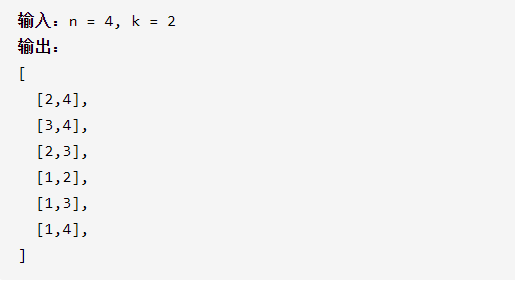

组合

详细思路

dfs，枚举选一个数，进入递归，或者不要这个数，记录深度也就是需要处理第几个数，begin防止只是交换

精确定义

begin

depth

```c
class Solution {
public:
    vector<vector<int>> combine(int n, int k) {

        vector<vector<int>>ans;
        vector<int>ans1;
        dfs(1,1,n,k,ans,ans1);
        return ans;
    }
    void dfs(int begin,int depth,int n,int k,vector<vector<int>>&ans,vector<int>&ans1){
        if(depth==k+1){
            ans.push_back(ans1);
        }
        for(int i=begin;i<=n;i++){
            ans1.push_back(i);
            dfs(i+1,depth+1,n,k,ans,ans1);
            ans1.pop_back();
        }
    }
};

踩过的坑
 dfs(i+1,depth+1,n,k,ans,ans1);
begin需要从i+1开始，防止重复使用某一个数
```

