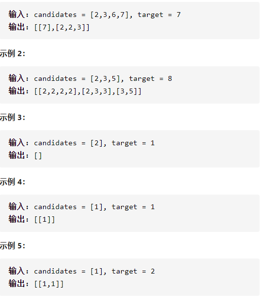

组合总数

详细思路

枚举组合每个数，放进ans1并记录add，dfs，如果add==target就放进ans，如果add》7就return，或者不要这个数字，只需要pop，记录vis数组防止重复

精确定义

num需要判断要不要的数字

begin应该从begin向前

add已经有的和

```c
class Solution {
public:
    vector<vector<int>>ans;
    vector<vector<int>> combinationSum(vector<int>& candidates, int target) {
        int n=candidates.size();
        vector<int>ans1;
        dfs(candidates,target,ans1,0,0);
        return ans;
    }
    void dfs(vector<int>&nums,int target,vector<int>&ans1,int add,int begin){
        if(add==target){
            ans.push_back(ans1);
            return;
        }
        if(add>target)return;
        for(int i=begin;i<nums.size();i++){
            if(i-1>=0&&nums[i]==nums[i-1])continue;
            ans1.push_back(nums[i]);
            dfs(nums,target,ans1,add+nums[i],i);
            ans1.pop_back();
        }
    }
};
```

踩过的坑

维护begin来让每次从begin向后，防止只是交换

