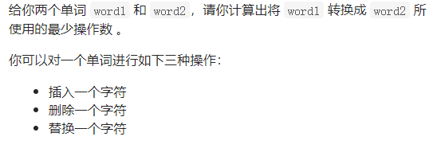
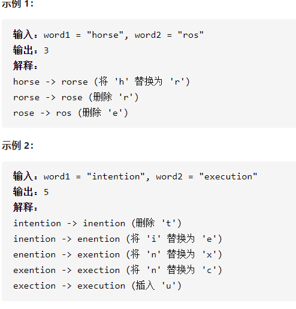

编辑距离

详细思路

前ij个字符具有某种递推关系

精确定义

dp ij word1前i个字符，word2前j个字符，操作数，dp00是没有字符，dp11是第一个字符

word i word0是第一个字符

转移

\- - a

\- - a dpi j=dpi-1 j-1

\- - a

\- - b dpij=min(dpi-1 j-1,dpi j-1,dpi-1 j) +1

初始化

空

\- - dp 0 j=j dpi 0=i

```c
class Solution {
public:
    int minDistance(string word1, string word2) {
        int n=word1.size(),m=word2.size();
        vector<vector<int>>dp(n+1,vector<int>(m+1,0x3f3f3f3f));
        dp[0][0]=0;
        for(int i=1;i<=n;i++)dp[i][0]=i;
        for(int j=1;j<=m;j++)dp[0][j]=j;
        for(int i=1;i<=n;i++){
            for(int j=1;j<=m;j++){
                if(word1[i-1]==word2[j-1])dp[i][j]=dp[i-1][j-1];
                if(word1[i-1]!=word2[j-1])dp[i][j]=min(dp[i-1][j],min(dp[i][j-1],dp[i-1][j-1]))+1;
            }
        }
        return dp[n][m];
    }
};


```

