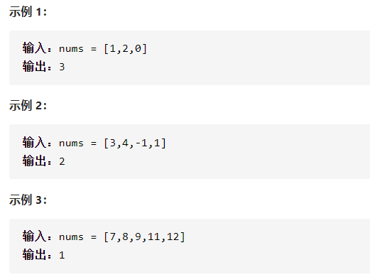
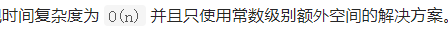

缺失的第一个正数



详细思路

长度是n的数组，最小未出现正数在[1,n+1]，如果[1,n]都在数组里，就是n+1，否则第一个不在的返回，遍历数组，如果数组都是正数，如果[1,n]出现在数组就在数字对应的位置打上负号标记，最后遍历一遍，如果都有负号标记就是n+1，如果有正号就是那个位置，怎么做到数组都是正数，可以对于非[1,n]的都赋值为n+1，反正也没用到值

精确定义

负号标志：只有遇到1到n的数num，才在nums[num-1]打上负号

```c
class Solution {
public:
    int firstMissingPositive(vector<int>& nums) {
        int n=nums.size();
        for(int i=0;i<n;i++){
            if(nums[i]<1||nums[i]>n)nums[i]=n+1;
        }
        for(int i=0;i<n;i++){
            int num=abs(nums[i]);
            if(num>=1&&num<=n){
                nums[num-1]=-abs(nums[num-1]);
            }
        }
        for(int i=0;i<n;i++){
            if(nums[i]>0)return i+1;
        }
        return n+1;
    }
};
```


踩过的坑

​      int num=abs(nums[i]);

​       nums[num-1]=-abs(nums[num-1]);