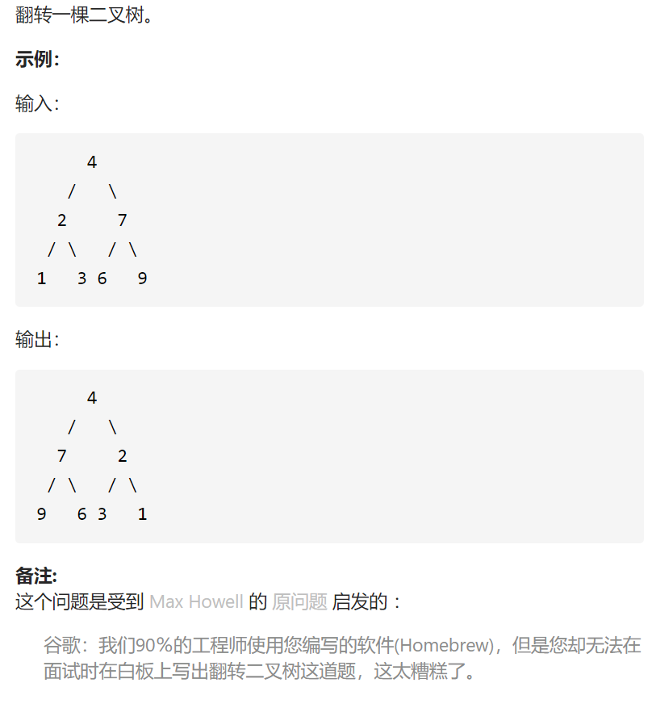

翻转二叉树



变量简洁正确完整思路

dfs，形参root，将root树翻转，只需要翻转root->left root->right，再将左右树翻转，边界是空节点

```c
class Solution {
public:
    TreeNode* invertTree(TreeNode* root) {
        dfs(root);
        return root;
    }
    void dfs(TreeNode*root){
        if(!root)return ;
        TreeNode*tmp=root->left;
        root->left=root->right;
        root->right=tmp;
        dfs(root->left);
        dfs(root->right);
    }
};
```

