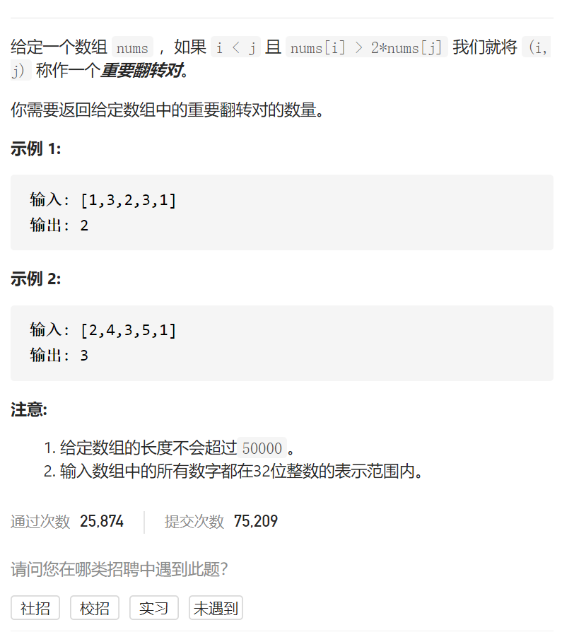
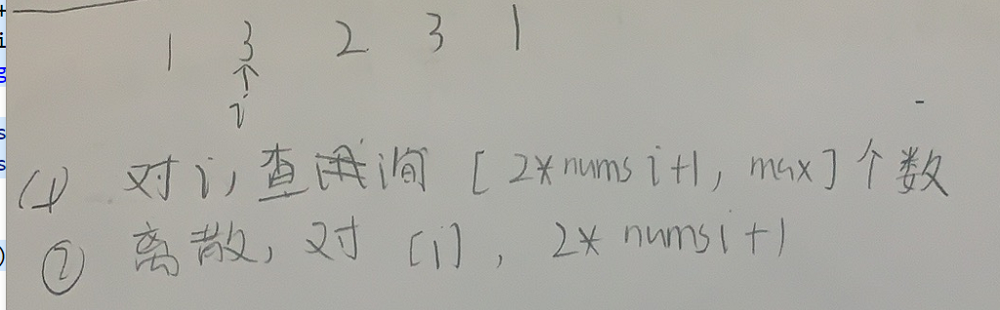
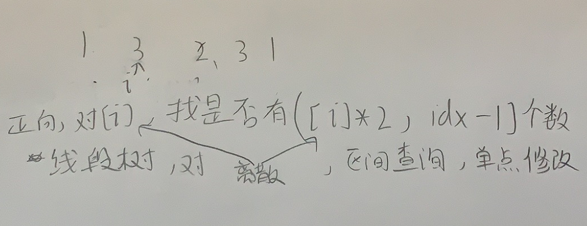

翻转对



抽象图固定维护寻找

TODO

归并排序、线段树、树状数组、平衡搜索树

树状数组



```c
class BitTree{
public:
    vector<int>tree;
    int n;
    BitTree(int n):n(n),tree(n+1){}
    int lowbit(int x){
        return x&-x;
    }
    void update(int i,int x){
        while(i<=n){
            tree[i]+=x;
            i+=lowbit(i);
        }
    }
    int query(int i){
        int ans=0;
        while(i){
            ans+=tree[i];
            i-=lowbit(i);
        }
        return ans;
    }
};
class Solution {
public:
    int reversePairs(vector<int>& nums) {
        vector<long>allNums;
        for(int i=0;i<nums.size();i++){
            allNums.push_back(nums[i]);
            allNums.push_back(((long)nums[i]*2+1));
        }
        sort(allNums.begin(),allNums.end());
        allNums.erase(unique(allNums.begin(),allNums.end()),allNums.end());
        //mp从1开始
        unordered_map<long,int>mp;
        for(int i=0;i<allNums.size();i++){
            mp[allNums[i]]=i+1;
        }
        //bitTree从1开始
        BitTree bitTree(allNums.size());
        int ans=0;
        for(int i=0;i<nums.size();i++){
            ans+=bitTree.query(allNums.size())-bitTree.query(mp[2*(long)nums[i]+1]-1);
            bitTree.update(mp[nums[i]],1);
        }
        return ans;
    }
};
```

线段树



```c
#define mid ((left+right)>>1)
#define ll(x) ((x<<1)+1)
#define rr(x) ((x<<1|1)+1)
class Solution {
public:
    vector<int>w;
    vector<int>sum;
    int n;
    //单点修改+1
    void update(int root,int left,int right,int idx){
        if(left==idx&&right==idx){
            sum[root]++;
            return;
        }
        if(idx<=mid)update(ll(root),left,mid,idx);
        else update(rr(root),mid+1,right,idx);
        pushup(root);
    }
    void pushup(int root){
        sum[root]=sum[ll(root)]+sum[rr(root)];
    }
    //区间查询
    int query(int root,int left,int right,int l,int r){
        if(l<=left&&right<=r)return sum[root];
        if(r<left||right<l)return 0;
        return query(ll(root),left,mid,l,r)+query(rr(root),mid+1,right,l,r);
    }
    int reversePairs(vector<int>& nums) {
        vector<long>allNums;
        for(int i=0;i<nums.size();i++){
            allNums.push_back(nums[i]);
            allNums.push_back((long)nums[i]*2+1);
        }
        sort(allNums.begin(),allNums.end());
        allNums.erase(unique(allNums.begin(),allNums.end()),allNums.end());
        unordered_map<long,int>mp;
        int idx=0;
        for(int i=0;i<allNums.size();i++){
            mp[allNums[i]]=idx++;
        }
        w.resize(idx);
        sum.resize(idx*4);
        int ans=0;
        for(int i=0;i<nums.size();i++){
            ans+=query(0,0,idx-1,mp[(long)nums[i]*2+1],idx-1);
            update(0,0,idx-1,mp[nums[i]]);
        }
        return ans;
    }
}; 
```


