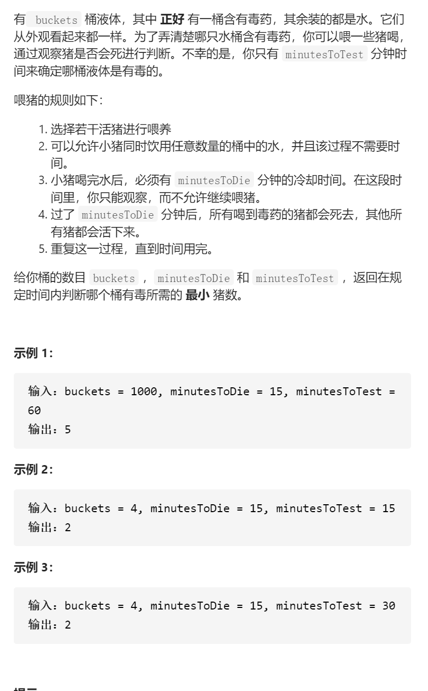
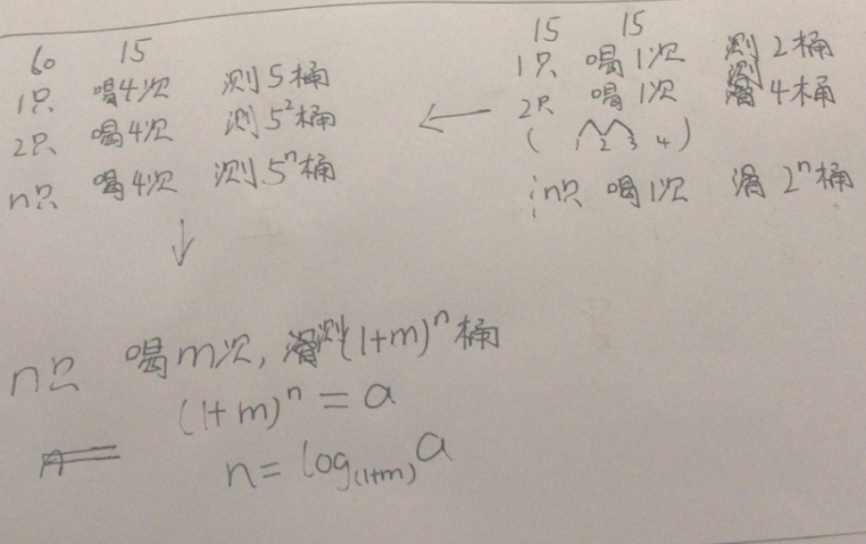

可怜的小猪



找规律，进制



```cpp
class Solution {

public:

  int poorPigs(int buckets, int minutesToDie, int minutesToTest) {

    int m=minutesToTest/minutesToDie;

    return ceil(log(buckets)/log(1+m));

  }

};
```


踩过的坑

 return ceil(log(buckets)/log(1+m));

向上取整ceil

logab=lgb/lga，也就是log(b)/log(a)