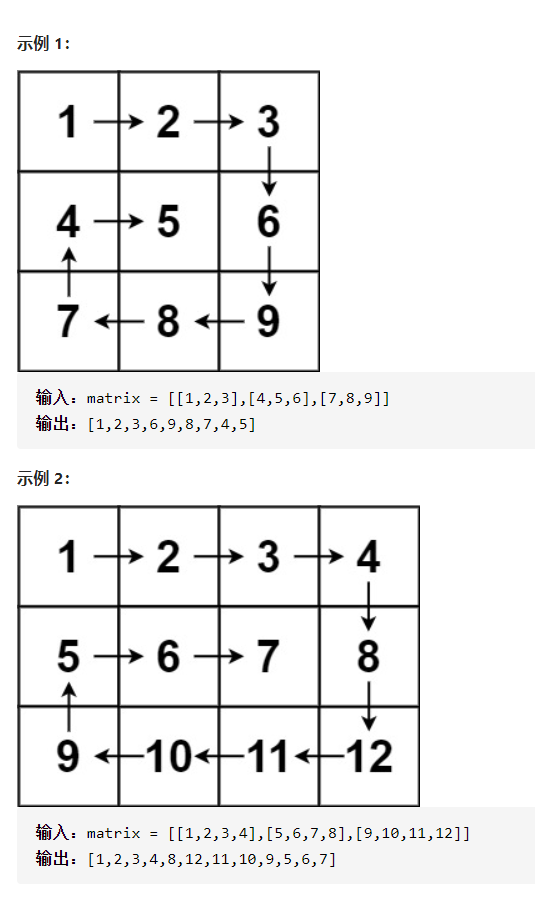
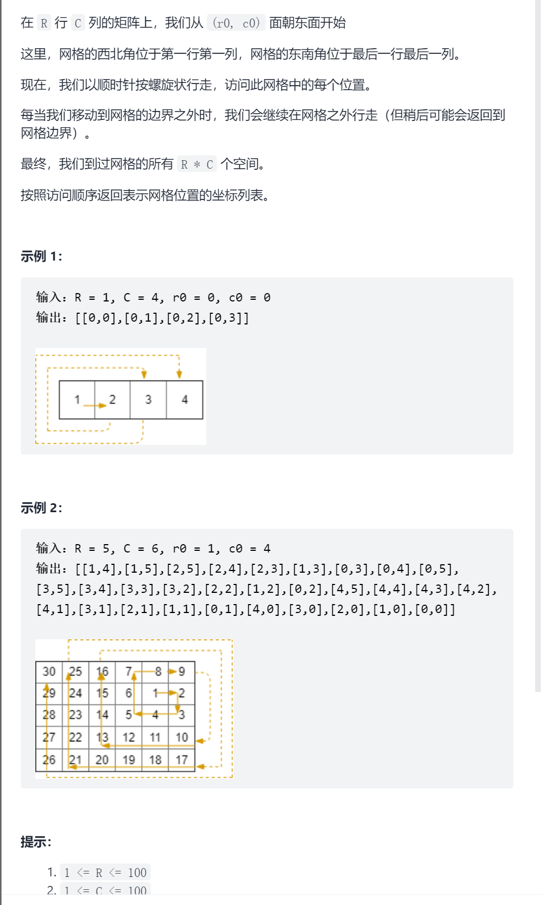
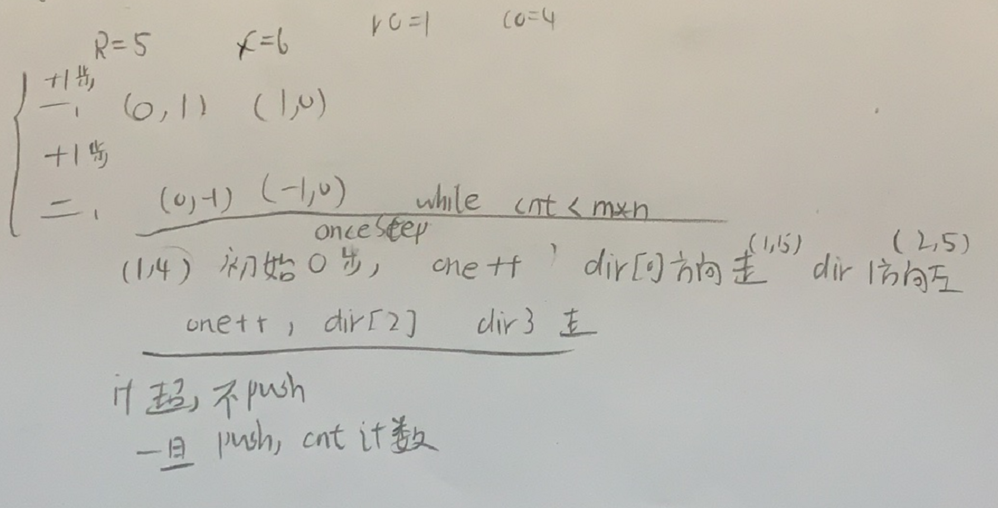

螺旋矩阵



详细思路

从最外层遍历，每一层，左上开始，右，下，左，上，维护上下左右最后一个元素边界，直到上小于下或者左大于右

精确定义

right右界，是先右遍历的最后一个元素下标

down

left

up

i第i个需要判断的元素

```c
class Solution {
public:
    vector<int> spiralOrder(vector<vector<int>>& matrix) {
        vector<int>ans;
        int right=matrix[0].size()-1,down=matrix.size()-1,left=0,up=0;
        while(left<=right&&up<=down){
            for(int i=left;i<=right;i++)ans.push_back(matrix[up][i]);
            for(int i=up+1;i<=down;i++)ans.push_back(matrix[i][right]);
            if(left!=right&&up!=down){
                for(int i=right-1;i>=left;i--)ans.push_back(matrix[down][i]);
                for(int i=down-1;i>=up+1;i--)ans.push_back(matrix[i][left]);
            }

            right--,down--,left++,up++;
        }
        return ans;
    }
};
```


踩过的坑

​      if(left!=right&&up!=down){

只剩最后一行或一列必须特判，不能继续下去，否则一定重复

------

螺旋矩阵III



抽象图一二ij

```c
class Solution {
public:
    vector<vector<int>> spiralMatrixIII(int rows, int cols, int rStart, int cStart) {
        int dir[4][2]={{0,1},{1,0},{0,-1},{-1,0}};
        int oneStep=0;
        int cnt=0;
        int x=rStart,y=cStart;
        vector<vector<int>>ans;
        while(cnt<rows*cols){
            oneStep++;
            for(int i=0;i<oneStep;i++){
                if(x>=0&&x<rows&&y>=0&&y<cols){
                    ans.push_back({x,y});
                    cnt++;
                }
                x+=dir[0][0],y+=dir[0][1];
            }
            for(int i=0;i<oneStep;i++){
                if(x>=0&&x<rows&&y>=0&&y<cols){
                    ans.push_back({x,y});
                    cnt++;
                }
                x+=dir[1][0],y+=dir[1][1];
            }
            oneStep++;
            for(int i=0;i<oneStep;i++){
                if(x>=0&&x<rows&&y>=0&&y<cols){
                    ans.push_back({x,y});
                    cnt++;
                }
                x+=dir[2][0],y+=dir[2][1];
            }
            for(int i=0;i<oneStep;i++){
                if(x>=0&&x<rows&&y>=0&&y<cols){
                    ans.push_back({x,y});
                    cnt++;
                }
                x+=dir[3][0],y+=dir[3][1];
            }
        }
        return ans;
    }
};
```

压缩

```c

class Solution {
public:
    vector<vector<int>> spiralMatrixIII(int rows, int cols, int rStart, int cStart) {
        int dir[4][2]={{0,1},{1,0},{0,-1},{-1,0}};
        int oneStep=0;
        int cnt=0;
        int x=rStart,y=cStart;
        vector<vector<int>>ans;
        while(cnt<rows*cols){
            for(int j=0;j<4;j++){
                if(j==0||j==2)oneStep++;
                for(int i=0;i<oneStep;i++){
                    if(x>=0&&x<rows&&y>=0&&y<cols){
                        ans.push_back({x,y});
                        cnt++;
                    }
                    x+=dir[j][0],y+=dir[j][1];
                }
            }
        }
        return ans;
    }
};
```


