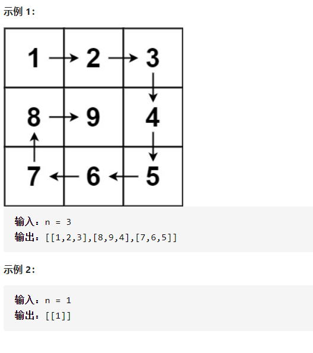

螺旋矩阵II



详细思路

定义rightdownleftup边界，一圈一圈遍历，遍历每一圈，直到四个边界相同

精确定义

rightdownleftup是包含在内的边界

num当前应该加的数

```c
class Solution {
public:
    vector<vector<int>> generateMatrix(int n) {
        vector<vector<int>>ans(n,vector<int>(n));
        int right=n-1,down=n-1,left=0,up=0;
        int num=1;
        while(1){
            if(right==left){
                ans[right][right]=num;
                break;
            }
            if(right<left)break;
            for(int i=left;i<=right;i++)ans[up][i]=num++;
            for(int i=up+1;i<=down;i++)ans[i][right]=num++;
            for(int i=right-1;i>=left;i--)ans[down][i]=num++;
            for(int i=down-1;i>=up+1;i--)ans[i][left]=num++;
            right--,down--,left++,up++;
        }
        return ans;
    }
};

踩过的坑
            if(right==down==left==up){
不行，左结合，1==left==up   0==0  
            if(right<left)break;
还要考虑偶数
```

