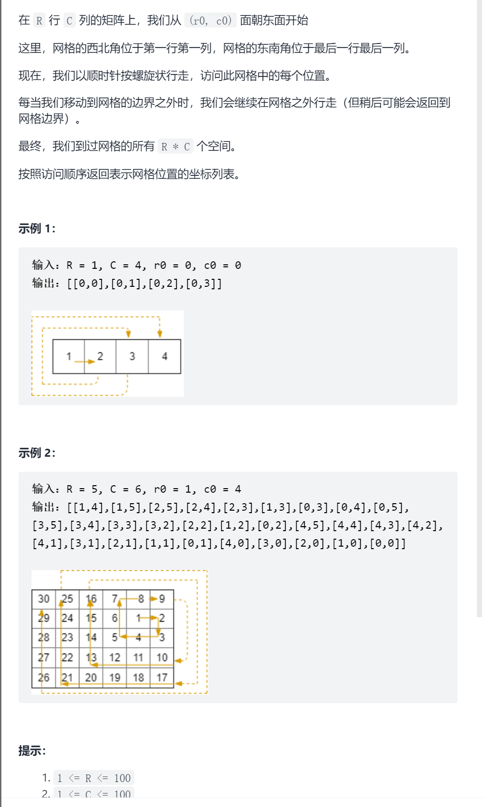
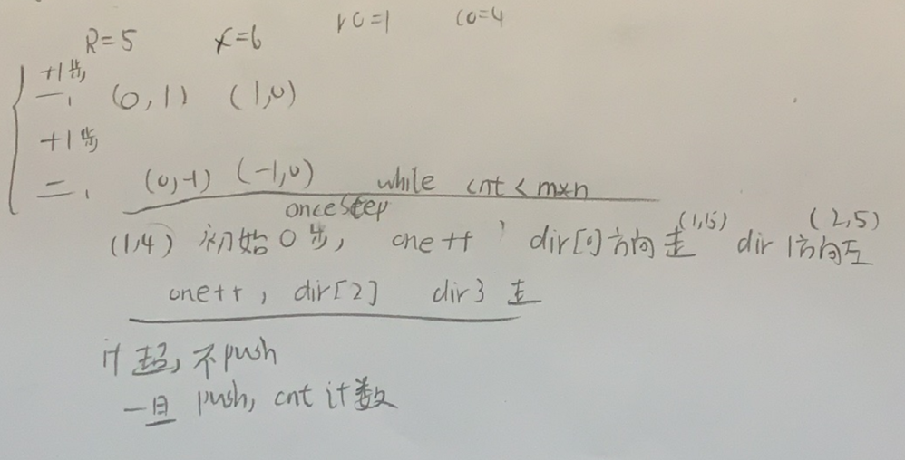

螺旋矩阵III



抽象图一二ij

```c
class Solution {
public:
    vector<vector<int>> spiralMatrixIII(int rows, int cols, int rStart, int cStart) {
        int dir[4][2]={{0,1},{1,0},{0,-1},{-1,0}};
        int oneStep=0;
        int cnt=0;
        int x=rStart,y=cStart;
        vector<vector<int>>ans;
        while(cnt<rows*cols){
            oneStep++;
            for(int i=0;i<oneStep;i++){
                if(x>=0&&x<rows&&y>=0&&y<cols){
                    ans.push_back({x,y});
                    cnt++;
                }
                x+=dir[0][0],y+=dir[0][1];
            }
            for(int i=0;i<oneStep;i++){
                if(x>=0&&x<rows&&y>=0&&y<cols){
                    ans.push_back({x,y});
                    cnt++;
                }
                x+=dir[1][0],y+=dir[1][1];
            }
            oneStep++;
            for(int i=0;i<oneStep;i++){
                if(x>=0&&x<rows&&y>=0&&y<cols){
                    ans.push_back({x,y});
                    cnt++;
                }
                x+=dir[2][0],y+=dir[2][1];
            }
            for(int i=0;i<oneStep;i++){
                if(x>=0&&x<rows&&y>=0&&y<cols){
                    ans.push_back({x,y});
                    cnt++;
                }
                x+=dir[3][0],y+=dir[3][1];
            }
        }
        return ans;
    }
};
```


压缩

```c
class Solution {
public:
    vector<vector<int>> spiralMatrixIII(int rows, int cols, int rStart, int cStart) {
        int dir[4][2]={{0,1},{1,0},{0,-1},{-1,0}};
        int oneStep=0;
        int cnt=0;
        int x=rStart,y=cStart;
        vector<vector<int>>ans;
        while(cnt<rows*cols){
            for(int j=0;j<4;j++){
                if(j==0||j==2)oneStep++;
                for(int i=0;i<oneStep;i++){
                    if(x>=0&&x<rows&&y>=0&&y<cols){
                        ans.push_back({x,y});
                        cnt++;
                    }
                    x+=dir[j][0],y+=dir[j][1];
                }
            }
        }
        return ans;
    }
};
```

