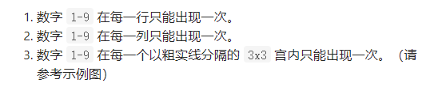
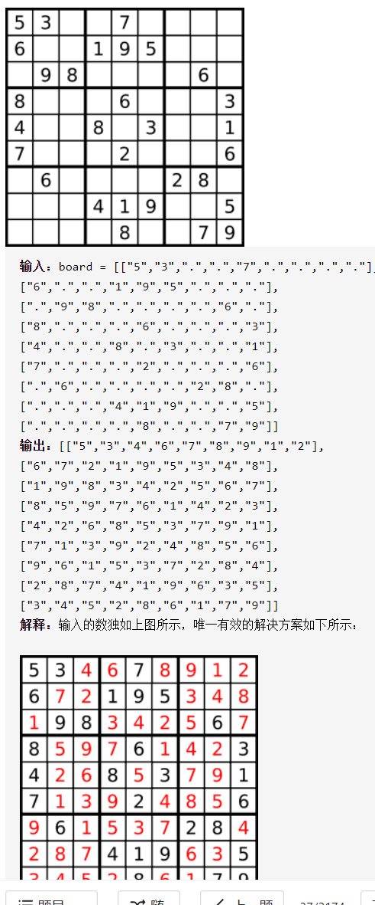

解数独

详细思路

row、col、box二维数组拿来检查行、类、盒对应数字是否已经有，先遍历一遍填入rowcolbox，同时将.也就是空格ij放到vector<pair>spaces用于后面的递归回溯，然后dfs，记录深度也就是第几个pair，如果深度==spaces.size()结束，对于spaces每一个ij，枚举每个数字，检查该数字rowcolbox，放入rowcolbox，dfs下一层，或者不要这个数字回溯。

精确定义

num枚举要或不要这个数字

depth需要检查第几个space

```c
class Solution {
public:
    vector<vector<int>>row;
    vector<vector<int>>col;
    vector<vector<int>>box;
    vector<pair<int,int>>spaces;
    bool valid;
    void solveSudoku(vector<vector<char>>& board) {
        row.resize(9,vector<int>(9,0));
        col.resize(9,vector<int>(9,0));
        box.resize(9,vector<int>(9,0));
        valid=true;
        for(int i=0;i<9;i++){
            for(int j=0;j<9;j++){
                if(board[i][j]=='.'){
                    spaces.push_back({i,j});
                }else{
                    int num=board[i][j]-'1';
                    row[i][num]=1;
                    col[j][num]=1;
                    box[i/3*3+j/3][num]=1;
                }
            }
        }
        dfs(board,0);
    }
    void dfs(vector<vector<char>>&board,int depth){
        if(depth==spaces.size()){
            valid=false;
            return;
        }
        auto [i,j]=spaces[depth];
        for(int num=0;num<9&&valid;num++){
            if(row[i][num]==0&&col[j][num]==0&&box[i/3*3+j/3][num]==0){
                board[i][j]=num+'0'+1;
                row[i][num]=col[j][num]=box[i/3*3+j/3][num]=1;
                dfs(board,depth+1);
                row[i][num]=col[j][num]=box[i/3*3+j/3][num]=0;
            }
        }
    }
};
```


踩过的坑

  vector<vector<int>>row(9,vector<int>(9,0));

  vector<vector<int>>col(9,vector<int>(9,0));

  vector<vector<int>>box(9,vector<int>(9,0));

成员变量不能直接初始化（构造函数），必须用resize在函数使用

for(int num=0;num<9;num++){

数1-9遍历0-8

找到一个就return不在继续，所以用valid

不能加回溯        board[i][j]='.';