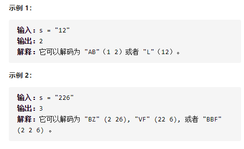
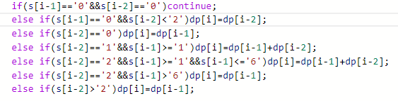

解码方法



详细思路

前i个字符具有某种递推关系

精确定义

dp i 前i个字符方法数，dp0是空字符dp1是第一个字符

s0是第一个字符

状态转移

\- - 1 2 

ifelse真谛，要么找满足的，要么只找不满足的，不要同时找

这道题找满足dpi-1  

if(满足dpi-1)dpi+=dpi-1

if(满足dpi-2)dpi+=dpi-2

如果找不满足的，那不满足dpi-1不代表就满足dpi-2了，麻烦

dpi=dpi-1 +1   +    dp i-2 +1

初始化

dp0 =0

dp1 =1 或0（第一个字符为0）

```c
class Solution {
public:
    int numDecodings(string s) {
        int n=s.size();
        if(n<2){
            if(n==0)return 0;
            else if(s[0]=='0')return 0;
            else return 1;
        }
        vector<int>dp(n+1,0);
        dp[0]=1;
        if(s[0]!='0')dp[1]=1;
        for(int i=2;i<=n;i++){
            if(s[i-1]!='0')dp[i]+=dp[i-1];
            if(s[i-2]=='1'||s[i-2]=='2'&&s[i-1]<='6')dp[i]+=dp[i-2];
        }
        return dp[n];
    }
};

```


压缩

```c
class Solution {
public:
    int numDecodings(string s) {
        int n=s.size();
        if(n<2){
            if(n==0)return 0;
            else if(s[0]=='0')return 0;
            else return 1;
        }
        int dpi2=1,dpi1;
        if(s[0]!='0')dpi1=1;
        else dpi1=0;
        for(int i=2;i<=n;i++){
            int dpi=0;
            if(s[i-1]!='0')dpi+=dpi1;
            if(s[i-2]=='1'||s[i-2]=='2'&&s[i-1]<='6')dpi+=dpi2;
            dpi2=dpi1;
            dpi1=dpi;
        }
        return dpi1;
    }
};
```


踩过的坑



什么是ifelse的真谛？要么要满足的，要么找不满足的，不要同时找

比如这道题，找满足dpi-1的+找满足dpi-2的，比找不满足dpi-1和不满足

dpi-2容易非常多，如果你都找那完蛋了