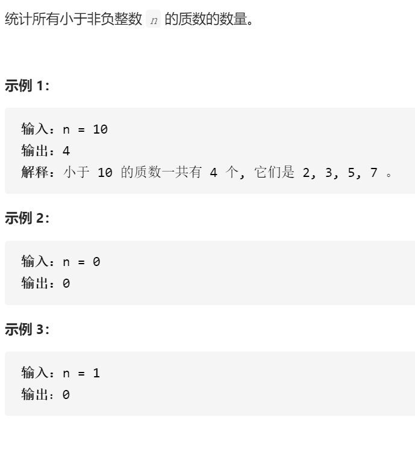

计数质数

变量简洁正确完整思路

埃氏筛，isPrime[]表示1是质数0不是，遍历2到n，if i是质数ans++且所有 2i 3i ii i i-1

小于n的倍数isPrime=0，如果有i不是质数且没有被=0过是不可能的，比如10 9 25

4 27等都在前面被他们的因数=0过，4 6 8等也在之前被=0过，所以一开始可以放心

全部=1，技巧是可以从i*i开始而不是2i开始，因为如2从4开始，3从9开始，4从16

开始，因为之前已经被更之前的=0过了

```c
class Solution {
public:
    int countPrimes(int n) {
        vector<int>isPrime(n,1);
        int ans=0;
        for(int i=2;i<n;i++){
            if(isPrime[i]){
                ans++;
                for(long j=(long)i*i;j<n;j+=i){
                    isPrime[j]=0;
                }
            }

        }
        return ans;
    }
};
```

