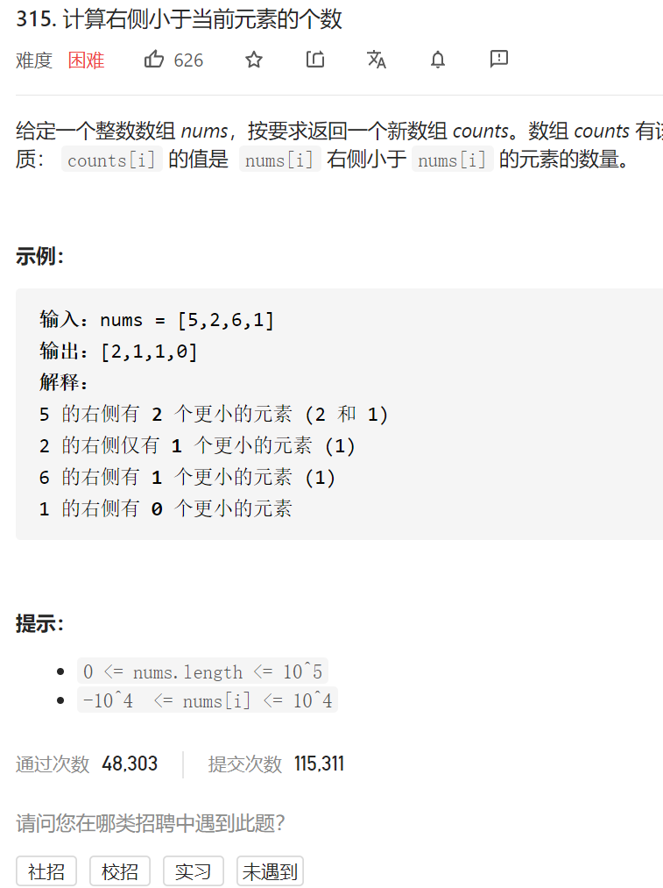
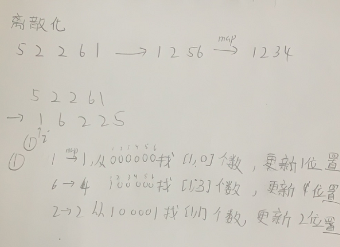
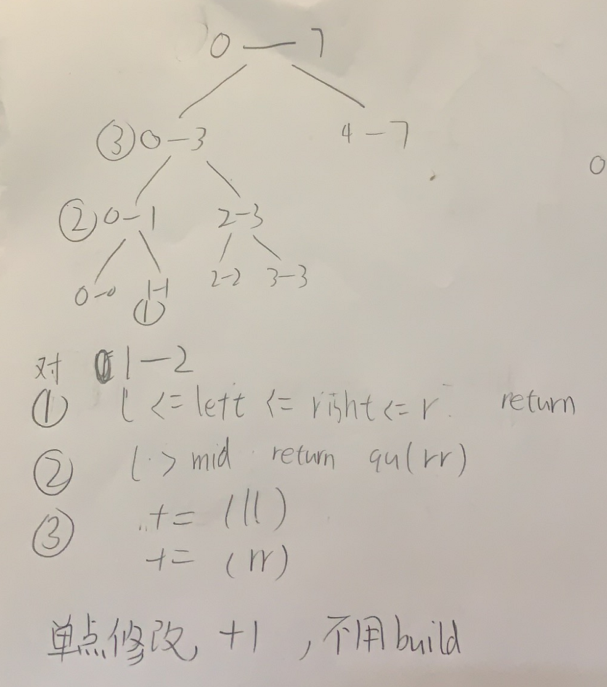
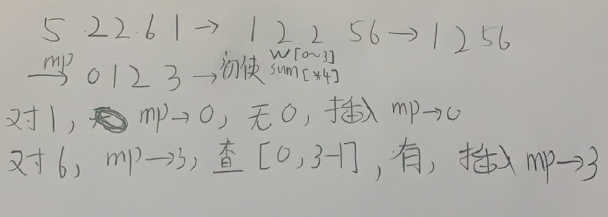

计算右侧小于当前元素的个数



变量简洁正确完整思路


归并排序

tmp数组辅助排序，dfs获得升序数组beg到mid  mid+1到end，然后双指针有序放入tmp

并最后copy到nums

```c
class Solution {
public:
    int maximumGap(vector<int>& nums) {
        int n=nums.size();

        vector<int>tmp(n);
        dfs(nums,tmp,0,n-1);

        int ans=0;
        for(int i=1;i<n;i++){
            ans=max(ans,nums[i]-nums[i-1]);
        }
        return ans;
    }
    void dfs(vector<int>&nums,vector<int>&tmp,int beg,int end){
        if(beg>=end)return;
        int mid=beg+(end-beg)/2;
        dfs(nums,tmp,beg,mid);
        dfs(nums,tmp,mid+1,end);
        int cur1=beg,cur2=mid+1,cur3=beg;
        while(cur1<=mid||cur2<=end){
            if(cur2>end||cur1<=mid&&nums[cur1]<=nums[cur2]){
                tmp[cur3]=nums[cur1];
                cur1++,cur3++;
            }else if(cur1>mid||cur2<=end&&nums[cur1]>nums[cur2]){
                tmp[cur3]=nums[cur2];
                cur2++,cur3++; 
            }
        }
        copy(tmp.begin()+beg,tmp.begin()+end+1,nums.begin()+beg);
    }
};

```


树状数组



```c
class BitTree{
public:
    vector<int>tree;
    int n;
    BitTree(int n):n(n),tree(n+1){};
    int lowbit(int x){
        return x&-x;
    }
    //i上的值+=x
    void update(int i,int x){
        while(i<=n){
            tree[i]+=x;
            i+=lowbit(i);
        }
    }
    //[1,i]的个数
    int query(int i){
        int ans=0;
        while(i>0){
            ans+=tree[i];
            i-=lowbit(i);
        }
        return ans;
    }
};
class Solution {
public:
    vector<int> countSmaller(vector<int>& nums) {
        auto sortNums=nums;
        sort(sortNums.begin(),sortNums.end());
        sortNums.erase(unique(sortNums.begin(),sortNums.end()),sortNums.end());
        unordered_map<int,int>mp;
        int i=1;
        for(int j=0;j<sortNums.size();j++){
            mp[sortNums[j]]=i++;
            
        }
        int n=nums.size();
        BitTree bitTree(mp[sortNums[sortNums.size()-1]]);
        vector<int>ans(n);
        for(int j=n-1;j>=0;j--){
            ans[j]=bitTree.query(mp[nums[j]]-1);
            bitTree.update(mp[nums[j]],1);
        }
        return ans;
    }
};

```



线段树



```c
//root从0开始
#define mid ((left+right)>>1)
#define ll(x) ((x<<1)+1)
#define rr(x) ((x<<1|1)+1)
class Solution {
public:
    vector<int>w;
    vector<int>sum;
    int n;
    //单点修改+1
    void update(int root,int left,int right,int idx){
        if(left==idx&&right==idx){
            sum[root]++;
            return;
        }
        if(idx<=mid)update(ll(root),left,mid,idx);
        else update(rr(root),mid+1,right,idx);
        pushup(root);
    }
    void pushup(int root){
        sum[root]=sum[ll(root)]+sum[rr(root)];
    }
    //区间查询
    int query(int root,int left,int right,int l,int r){
        if(l<=left&&right<=r)return sum[root];
        if(r<left||right<l)return 0;
        return query(ll(root),left,mid,l,r)+query(rr(root),mid+1,right,l,r);
    }
    vector<int> countSmaller(vector<int>& nums) {
        vector<int>allNums=nums;
        sort(allNums.begin(),allNums.end());
        allNums.erase(unique(allNums.begin(),allNums.end()),allNums.end());
        int idx=0;
        unordered_map<int,int>mp;
        for(int num:allNums){
            mp[num]=idx++;
        }
        w.resize(idx);
        sum.resize(4*idx);
        int n=nums.size();
        vector<int>ans(n);
        ans[n-1]=0;
        update(0,0,idx-1,mp[nums[n-1]]);
        //cout<<query(0,0,idx-1,0,idx-1)<<endl;
        for(int i=n-2;i>=0;i--){
            int l=0,r=mp[nums[i]]-1;
            //cout<<l<<' '<<r<<endl;
            ans[i]=query(0,0,idx-1,0,mp[nums[i]]-1);

            update(0,0,idx-1,mp[nums[i]]);
        }
        return ans;
    }
};

```

AVL树

使用multiset

```c
class Solution {
public:
    int countRangeSum(vector<int>& nums, int lower, int upper) {
        multiset<long long> helper;
        helper.insert(0);
        int ans=0;
        long long sum=0;
        for (int &i:nums)
        {
            sum+=i;
            ans+=distance(helper.lower_bound(sum-upper),helper.upper_bound(sum-lower));
            helper.insert(sum);
        }
        return ans;
    }
};


```

