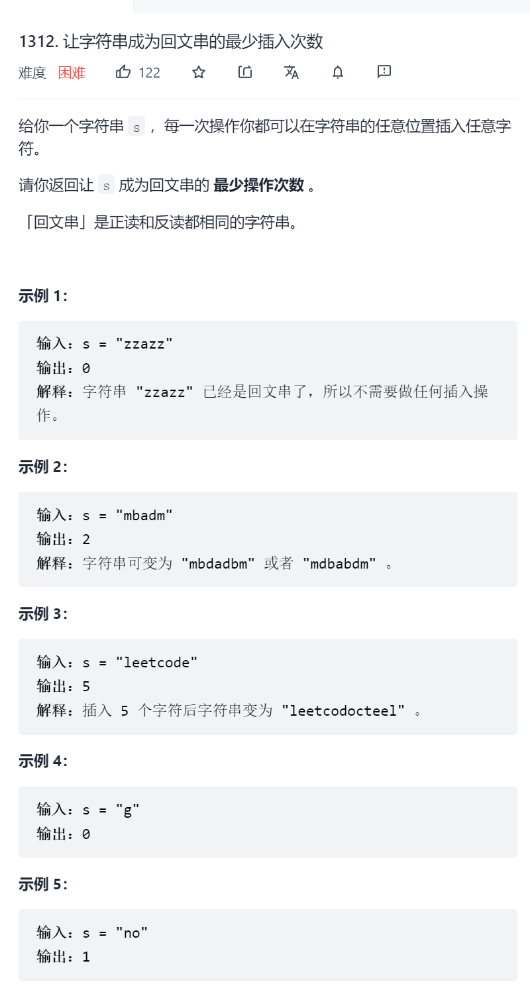

方法一：动态规划
设我们通过最少的操作次数将字符串 s 变成了回文串 s'，根据 s' 长度的奇偶性，会有如下的两种情况：

若 s' 的长度为奇数，那么它的回文中心为单个字符 c。例如当 s' = "adgda" 时，它的回文中心为单个字符 "g"。我们可以断定，回文中心 c 一定是原字符串 s 中的字符，否则如果 c 是通过操作添加的字符，那么我们可以舍弃这一步操作，此时 s' 成为长度为偶数的字符串，并且它仍是回文串（在例子中，即 "adgda" -> "adda"）。

若 s' 的长度为偶数，那么它的回文中心为两个字符 cc，例如当 s' = "adggda" 时，它的回文中心为两个字符 "gg"。我们同样可以断定，回文中心 cc 一定是原字符串中的两个字符，否则如果 cc 中有至少一个是通过操作添加的字符，那么我们可以舍弃这些操作，此时 s' 成为长度为偶数（舍弃一次操作）或奇数（舍弃两次操作）的字符串，并且它仍是回文串（在例子中，即 "adggda" -> "adgda" 或 "adggda" -> "adda"）。

根据此断定，我们还可以得到一条推论，即回文中心 cc 一定是原字符串中的两个连续的字符。这是因为我们的操作只能添加字符而不能删除字符，因此在回文中心 cc 是原字符串中的两个字符的情况下，它们一定也是连续的。
这样以来，我们可以首先枚举回文中心（单个字符或两个字符），再对回文中心左侧的字符串 p 和右侧的字符串 q 进行相应的操作。具体地，我们希望通过最少的操作次数（添加最少的字符），使得 inv(p) 和 q 变成相同的字符串，其中 inv(p) 表示将字符串 p 翻转之后得到的字符串，例如当 p = "abcd" 时，inv(p) = "dcba"。

那么如何解决这个子问题呢？我们首先用 inv(p) 代替 p，这样我们的子问题变成：添加最少的字符，使得 p 和 q 变成相同的字符串。此时答案就变得十分明朗了，我们只需要得到 p 和 q 的最长公共子序列，设其长度为 l，那么最少添加 |p| + |q| - l * 2 个字符，就可以将 p 和 q 变成相同的字符串。例如：

当 p = "abcde"，q = "adefg" 时，他们的最长公共子序列为 "ade"，长度为 3。此时我们可以将 p，q 和它们的最长公共子序列写成如下的形式：


p = a b c d e
q = a     d e f g
    a     d e
可以看出，以最长公共子序列为基础，我们只需要在 "a" 和 "d" 之间添加字符 "bc"，在 "d" 之后添加字符 "fg"，得到的字符串 "abcdefg" 就是 p 和 q 变成的相同字符串，即我们在 p 和 q 中分别添加 2 个字符，就可以得到该字符串。另一方面，|p| + |q| - l = 5 + 5 - 3 * 2 = 4，即我们一共需要添加 4 个字符，这两个值相等。

枚举回文中心的时间复杂度为 O(N)O(N)，而计算两个字符串的最长公共子序列的时间复杂度为 O(N^2)O(N 
2
 )，那么整个算法的时间复杂度为 O(N^3)O(N 
3
 )，无法在规定的时间内通过本题。我们必须要对算法进行一些优化。

仔细回想一下算法的过程，我们依次进行了如下的两个步骤：

枚举回文中心，并得到回文中心左右两侧的字符串 p 和 q；

计算 inv(p) 和 q 的最长公共子序列。

我们能否把这两个步骤合并起来呢？这两个步骤到底得到了什么结果？

如果我们将 inv(p) 和 q 的最长公共子序列设为 r，那么在这两个步骤之后，我们在 inv(p) 中得到了 inv(r)，q 中得到了 r，并且得到了回文中心 c 或 cc。我们将这三个部分拼在一起，实际上得到了一个回文串 inv(r) + c/cc + r，并且它是原字符串 s 的一个子序列！这个回文串越长，就意味着我们需要添加的字符越少。也就是说，我们需要在原字符串 s 中找到一个最长回文子序列，若其长度为 l，那么我们只需要添加 |s| - l 个字符，就可以将 s 变为回文串。

如何从直观上来理解它呢？当我们在原字符串 s 中找到最长回文子序列后，对于在 s 中但不在子序列中的那些字符，如果其在回文中心的左侧，我们就在右侧对应的位置添加一个相同的字符；如果其在回文中心的右侧，我们就在左侧对应的位置添加一个相同的字符。例如：

当 s = "dabca" 时，它的最长回文子序列为 "aba"，我们将 s 写成如下的形式：


      a   b   a       (回文中心为 b)
s = d a   b c a
s = d a   b c a d     (字符 d 在回文中心左侧，那么在右侧对应位置添加一个相同的字符)
s = d a c b c a d     (字符 c 在回文中心右侧，那么在左侧对应位置添加一个相同的字符)
我们添加了 2 个字符将 s 变为回文串。另一方面，|s| - l = 5 - 3 = 2，这两个值相等。

那么如何求出 s 的最长回文子序列 sPA 呢？实际上，sPA 就等同于 s 和 inv(s) 的最长公共子序列，即 sPA 既是 s 的子序列，也是 inv(s) 的子序列（这样就保证了 sPA 是一个回文的子序列）。这样以来，我们只要在 O(N^2)O(N 
2
 ) 的时间求出 s 和 inv(s) 的最长公共子序列，根据它的长度 l，通过 |s| - l 就可以得到答案。

关于「最长公共子序列」或「最长回文子序列」的更多信息，可以参考力扣对应的两道题目：

1143. 最长公共子序列

516. 最长回文子序列

C++Python3

```c
class Solution {
public:
    int minInsertions(string s) {
        int n = s.size();
        string t(s.rbegin(), s.rend());
        vector<vector<int>> dp(n + 1, vector<int>(n + 1));
        for (int i = 1; i <= n; ++i) {
            for (int j = 1; j <= n; ++j) {
                dp[i][j] = max(dp[i - 1][j], dp[i][j - 1]);
                if (s[i - 1] == t[j - 1]) {
                    dp[i][j] = max(dp[i][j], dp[i - 1][j - 1] + 1);
                }
            }
        }
        return n - dp[n][n];
    }
};
```

复杂度分析

时间复杂度：O(N^2)O(N 
2
 )，其中 NN 是字符串 s 的长度。

空间复杂度：O(N^2)O(N 
2
 )。

方法二：区间动态规划
除了方法一之外，我们也可以使用经典的区间动态规划方法来解决本题，并且这种方法更加直观。

我们用 dp[i][j] 表示对于字符串 s 的子串 s[i:j]（这里的下标从 0 开始，并且 s[i:j] 包含 s 中的第 i 和第 j 个字符），最少添加的字符数量，使得 s[i:j] 变为回文串。

我们从外向内考虑 s[i:j]：

如果 s[i] == s[j]，那么最外层已经形成了回文，我们只需要继续考虑 s[i+1:j-1]；

如果 s[i] != s[j]，那么我们要么在 s[i:j] 的末尾添加字符 s[i]，要么在 s[i:j] 的开头添加字符 s[j]，才能使得最外层形成回文。如果我们选择前者，那么需要继续考虑 s[i+1:j]；如果我们选择后者，那么需要继续考虑 s[i:j-1]。

因此我们可以得到如下的状态转移方程：


dp[i][j] = min(dp[i + 1][j] + 1, dp[i][j - 1] + 1)                     if s[i] != s[j]
dp[i][j] = min(dp[i + 1][j] + 1, dp[i][j - 1] + 1, dp[i + 1][j - 1])   if s[i] == s[j]
边界条件为：


dp[i][j] = 0   if i >= j
注意该动态规划为区间动态规划，需要注意 dp[i][j] 的计算顺序。一种可行的方法是，我们递增地枚举子串 s[i:j] 的长度 span = j - i + 1，再枚举起始位置 i，通过 j = i + span - 1 得到 j 的值并计算 dp[i][j]。这样的计算顺序可以保证在计算 dp[i][j] 时，状态转移方程中的状态 dp[i + 1][j]，dp[i][j - 1] 和 dp[i + 1][j - 1] 均已计算过。

C++Python3

```c
class Solution {
public:
    int minInsertions(string s) {
        int n = s.size();
        vector<vector<int>> dp(n, vector<int>(n));
        for (int span = 2; span <= n; ++span) {
            for (int i = 0; i <= n - span; ++i) {
                int j = i + span - 1;
                dp[i][j] = min(dp[i + 1][j], dp[i][j - 1]) + 1;
                if (s[i] == s[j]) {
                    dp[i][j] = min(dp[i][j], dp[i + 1][j - 1]);
                }
            }
        }
        return dp[0][n - 1];
    }
};
```

复杂度分析

时间复杂度：O(N^2)O(N 
2
 )，其中 NN 是字符串 s 的长度。

空间复杂度：O(N^2)O(N 
2
 )。

