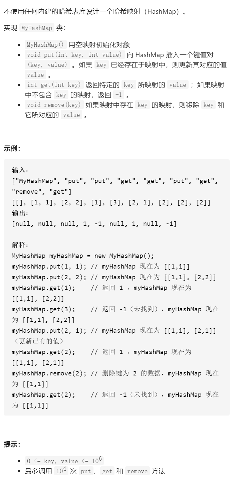

设计哈希映射



链地址法

```c
class MyHashMap {
public:
    vector<list<pair<int,int>>>data;
    static const int base=911;
    static int hash(int key){
        return key%base;
    }
    MyHashMap():data(base) {
        
    }

    void put(int key, int value) {
        int h=hash(key);
        for(auto it=data[h].begin();it!=data[h].end();it++){
            if((*it).first==key){
                (*it).second=value;
                return;
            }
        }
        data[h].push_back({key,value});
    }

    int get(int key) {
        int h=hash(key);
        for(auto it=data[h].begin();it!=data[h].end();it++){
            if((*it).first==key)return (*it).second;
        }
        return -1;
    }

    void remove(int key) {
        int h=hash(key);
        for(auto it=data[h].begin();it!=data[h].end();it++){
            if((*it).first==key){
                data[h].erase(it);
                return ;
            }
        }
    }
};
```


 开放地址法

```c
class MyHashMap {
public:
    const int SIZE=1e4;
    vector<pair<int,int>>data;
    MyHashMap():data(SIZE,{-1,-1}) {
    }

    void put(int key, int value) {
        data[hash(key)]={key,value};
    }

    int get(int key) {
        return data[hash(key)].second;
    }

    void remove(int key) {
        //hash {1,value}和{100001,value}，删掉1，如果只是改成{-1,-1}，会让100001hash时不再+1，但是100001原来应该有+1
        data[hash(key)]={-2,-1};
    }
    int hash(int key){
        int i=key%SIZE;
        //1和SIZE+1取余后相等，+1就可以，或者原来不是-1有值，+1就可以
        while(data[i].first!=key&&data[i].first!=-1){
            i=(i+1)%SIZE;
        }
        return i;
    }
};
```

