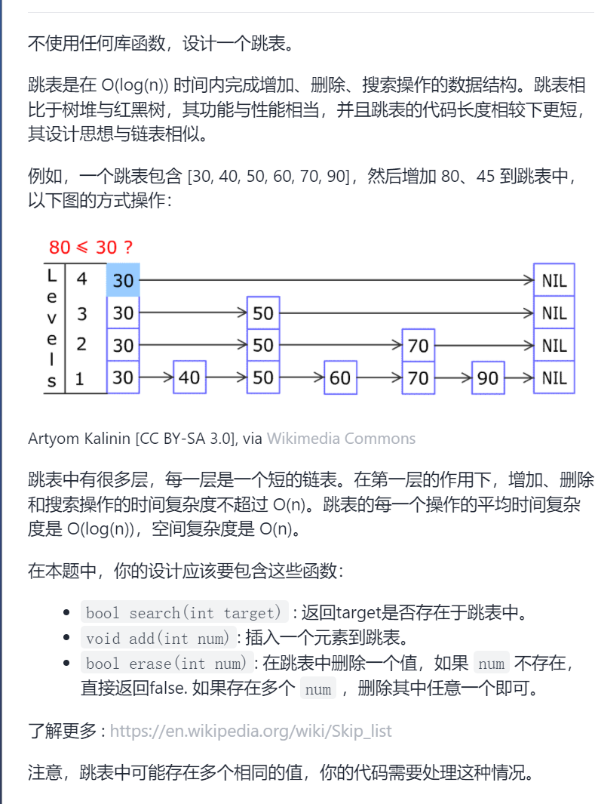
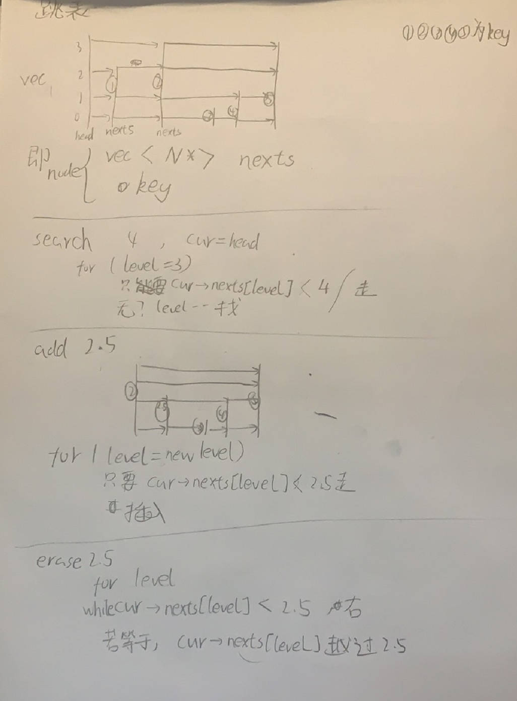

设计跳表

抽象图一二ij



```c
class Skiplist {
public:
    struct Node{
        int key;
        vector<Node*>nexts;
        Node(int level,int k):nexts(level+1),key(k){};
    };
    Node*head;
    int allLevel=-1;
    Skiplist() {
        head=new Node(31,-1);
    }
    bool search(int key) {
        Node*cur=head;
        for(int curLevel=allLevel;curLevel>=0;curLevel--){
            while(cur->nexts[curLevel]&&cur->nexts[curLevel]->key<key){
                cur=cur->nexts[curLevel];
            }
            if(cur->nexts[curLevel]&&cur->nexts[curLevel]->key==key)return true;
        }
        return false;
    }
    void add(int key) {
        int newLevel=getLevel();
        allLevel=max(allLevel,newLevel);
        Node*cur=head;
        Node*newNode=new Node(newLevel,key);
        for(int curLevel=allLevel;curLevel>=0;curLevel--){
            while(cur->nexts[curLevel]&&cur->nexts[curLevel]->key<key){
                cur=cur->nexts[curLevel];
            }
            if(curLevel<=newLevel){
                newNode->nexts[curLevel]=cur->nexts[curLevel];
                cur->nexts[curLevel]=newNode;
            }
        }
    }
    bool erase(int key) {
        Node*cur=head;
        bool flag=false;
        for(int curLevel=allLevel;curLevel>=0;curLevel--){
            while(cur->nexts[curLevel]&&cur->nexts[curLevel]->key<key){
                cur=cur->nexts[curLevel];
            }
            if(cur->nexts[curLevel]&&cur->nexts[curLevel]->key==key){
                flag=true;
                Node*tmp=cur->nexts[curLevel]->nexts[curLevel];
                cur->nexts[curLevel]->nexts[curLevel]=nullptr;
                cur->nexts[curLevel]=tmp;
            }
        }
        if(flag==false)return false;
        return true;
    }
    int getLevel(){
        int ans=0;
        while(ans<32&&rand()<RAND_MAX*0.25)ans++;
        return ans;
    }
};

```

