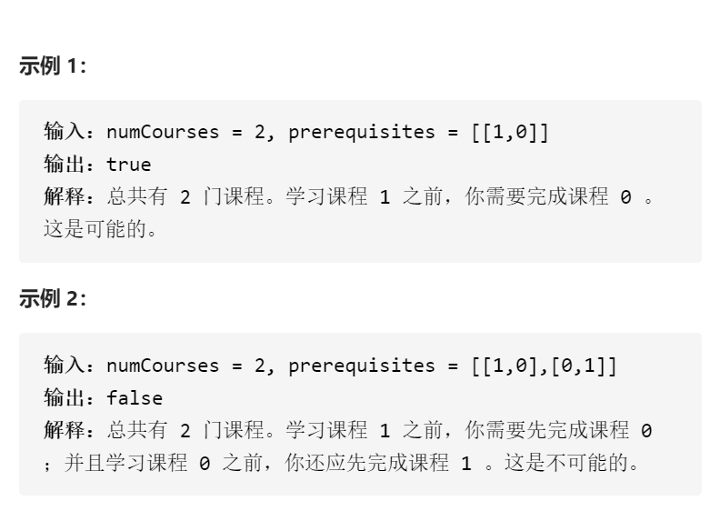

课程表



变量简洁正确完整思路

有向图，拓扑排序，图edges前置节点对应当前节点，入度indegrees节点对应入度，topoSort形参n寻找n个节点组成拓扑排序，que存储入度为0的节点，用vis来判断que遍历了

多少节点

```c
class Solution {
public:
    bool canFinish(int numCourses, vector<vector<int>>& prerequisites) {
        edges.resize(numCourses);
        indegrees.resize(numCourses);
        for(auto &node:prerequisites){
            edges[node[1]].push_back(node[0]);
            indegrees[node[0]]++;
        }
        return topoSort(numCourses);
    }
private:
    bool topoSort(int n){
        int vis=0;
        queue<int>que;
        for(int i=0;i<n;i++)if(indegrees[i]==0)que.push(i);
        while(!que.empty()){
            int cur=que.front();que.pop();
            vis++;
            for(int nex:edges[cur])if(--indegrees[nex]==0)que.push(nex);
        }
        return vis==n;
    }
    vector<vector<int>>edges;
    vector<int>indegrees;
};
```

