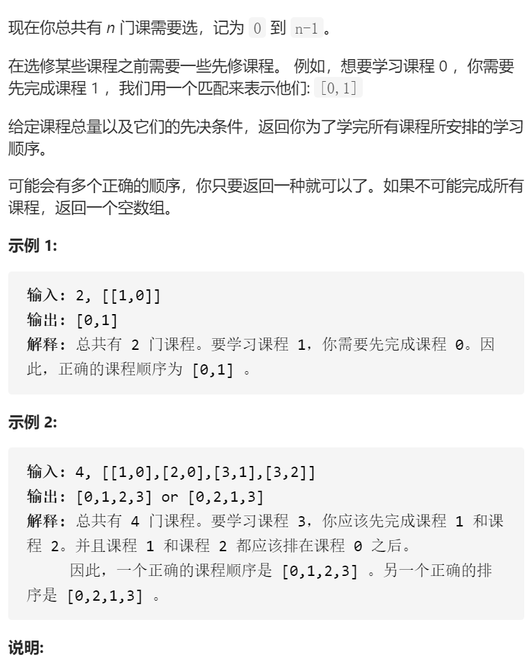

课程表II



变量简洁正确完整思路

有向图，拓扑排序，图edges前置节点对应当前节点，入度indegrees节点对应入度，topoSort形参n寻找n个节点组成拓扑排序，que存储入度为0的节点

```c
class Solution {
public:
    vector<int> findOrder(int numCourses, vector<vector<int>>& prerequisites) {
        edges.resize(numCourses);
        indegrees.resize(numCourses);
        ans.reserve(numCourses);
        for(auto &nodes:prerequisites){
            int cur=nodes[0],pre=nodes[1];
            edges[pre].push_back(cur);
            indegrees[cur]++;
        }
        return topoSort(numCourses);
    }
private:
    vector<int>topoSort(int n){
        queue<int>que;
        for(int i=0;i<n;i++)if(indegrees[i]==0)que.push(i);
        while(!que.empty()){
            int cur=que.front();que.pop();
            ans.push_back(cur);
            for(int nex:edges[cur])if(--indegrees[nex]==0)que.push(nex);
        }
        if(ans.size()<n)return {};
        return ans;
    }
    //若下标不连续或不为int，vector换成unordered_map
    vector<vector<int>>edges;
    vector<int>indegrees;
    vector<int>ans;
};

```

