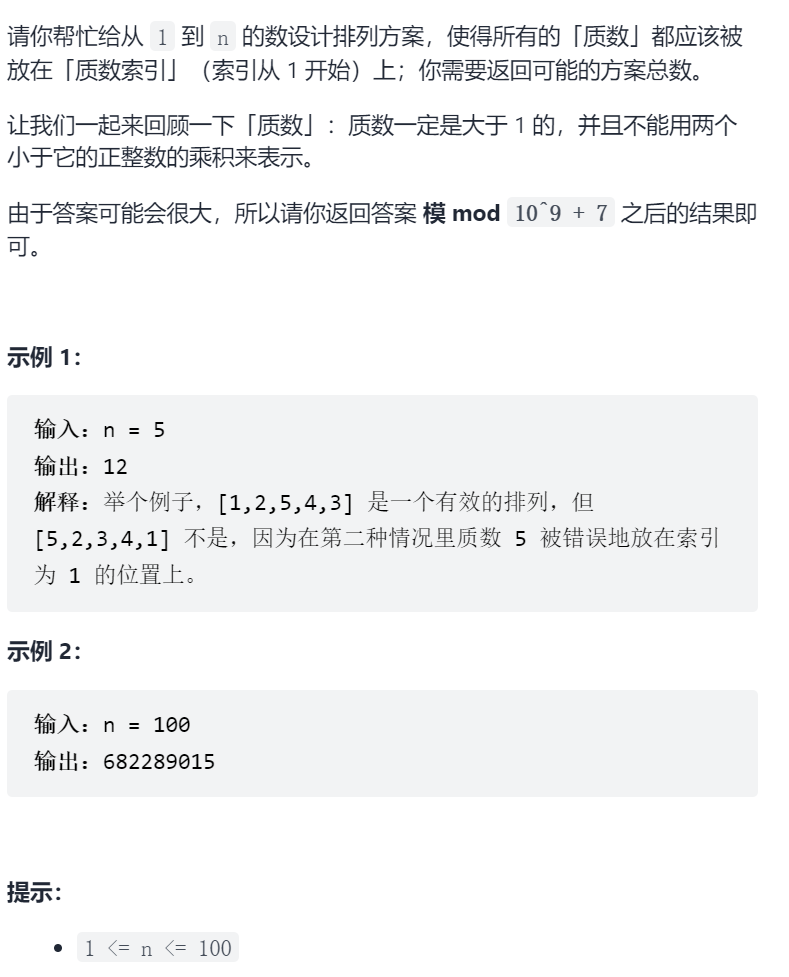
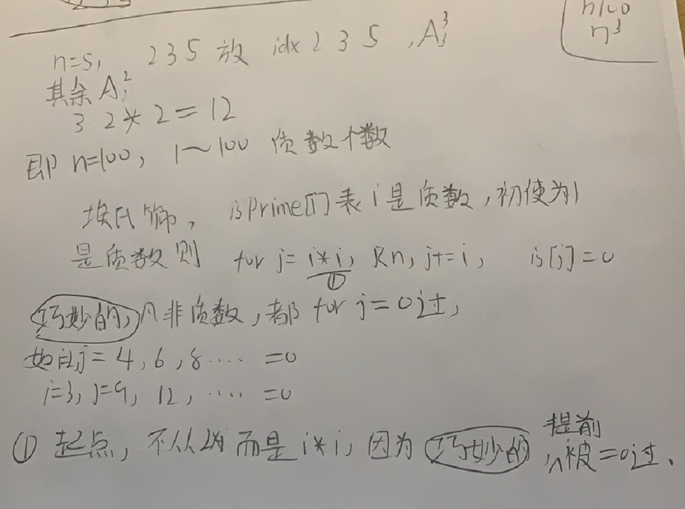

质数排列



抽象图一二ij



​	

```c
class Solution {
public:
    int numPrimeArrangements(int n) {
        const int mod=1e9+7;
        vector<int>isPrime(n+1,1);
        int cnt=0;
        for(int i=2;i<=n;i++){
            if(isPrime[i]){
                cnt++;
                for(int j=i*i;j<=n;j+=i){
                    isPrime[j]=0;
                }
            }
        }
        long ans=1;
        for(int i=2;i<=cnt;i++){
            ans=(ans*i)%mod;
        }
        for(int i=2;i<=n-cnt;i++){
            ans=(ans*i)%mod;
        }
        return ans;
    }
};
```

