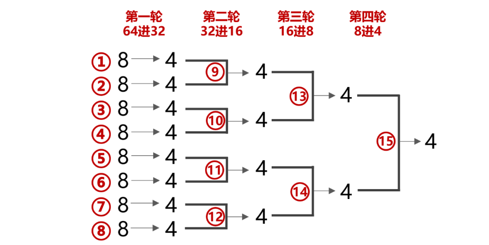
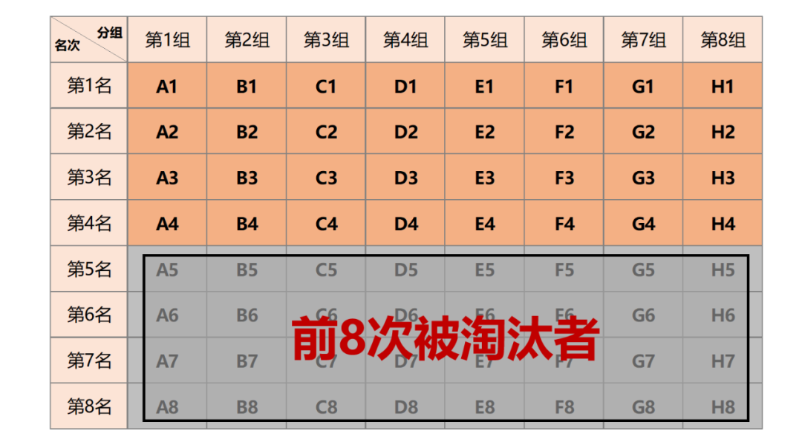
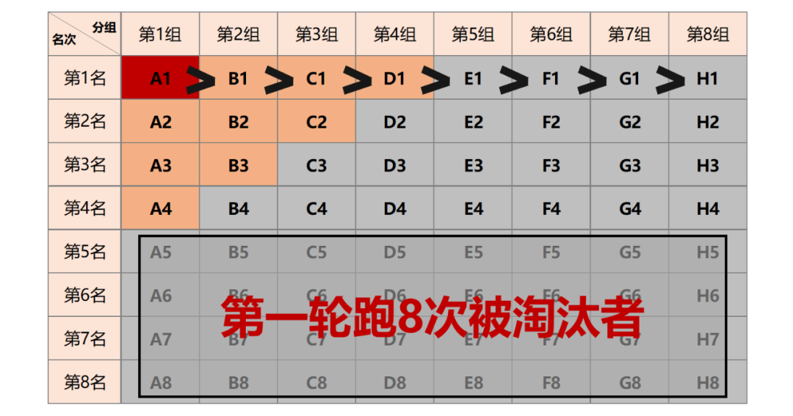
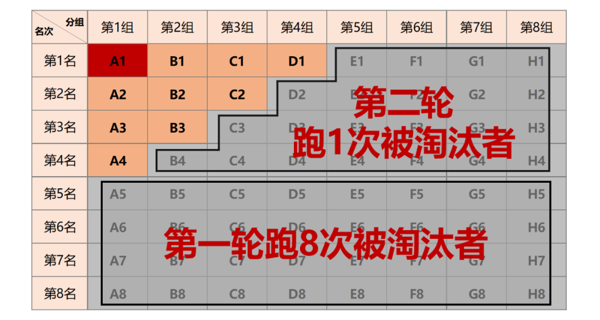
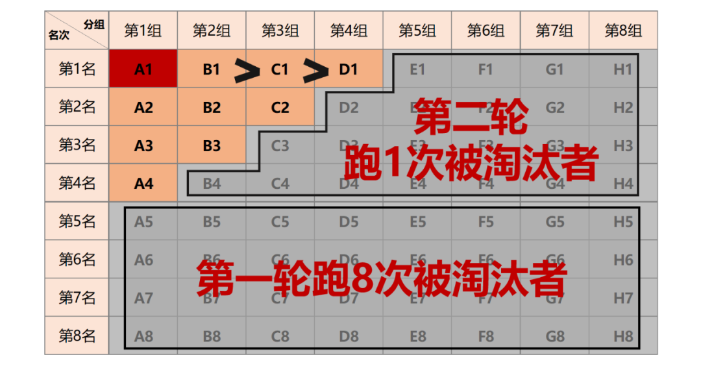
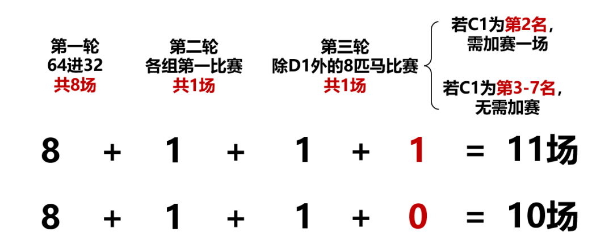

###  目录

- - [常规思路](https://www.icode9.com/content-4-1071592.html#_6)
  - [正确答案解析](https://www.icode9.com/content-4-1071592.html#_13)
  - - [第一轮：8场](https://www.icode9.com/content-4-1071592.html#8_14)
    - [第二轮：1场](https://www.icode9.com/content-4-1071592.html#1_17)
    - [第三轮：1场或2场](https://www.icode9.com/content-4-1071592.html#12_23)
    - [总结](https://www.icode9.com/content-4-1071592.html#_34)

引子：在面试大厂时，怎么也没想到会考我一道脑筋急转弯。

问题：有64匹马和8条跑道，每次只允许最多8匹马同时比赛（假定每匹马每次比赛速度相同），但是没有秒表不能计时，问最少要比多少次，才能选出最快的4匹马？

## 常规思路

因为每匹马都至少得跑一次，而我们只需要选出最快的4匹，所以首先肯定得跑8场，每场淘汰4匹马。之后我们很容易想到**将两组获胜的4匹马进行组合比赛，就可找到最快的4匹马**。

这样解题，**共需4轮15次**，但不是最优解。

## 正确答案解析

### 第一轮：8场

把64匹马随机分为8组，**总共比8场，淘汰每组后4名**。为方便可视，我将马进行标记组别并同时记录每组中各马的名次。

### 第二轮：1场

**在8组中选每组第1名的马进行比赛**，按名次排序（重新对马进行标记，第一名为A1，其次为B1、C1、D1…）。

这时A1为全场最快，直接晋级。同时知道A1>B1>C1>D1>E1>F1>G1>H1，并且由第一轮的结果可知D1>D2>D3>D4。
因为总共需要选出4匹，**综上可得出A1>B1>C1>D1>D2>D3>D4，所以D2、D3、D4一定被淘汰**。同理，B4、C3-4、D2-4、E1-4、F1-4、G1-4、F1-4被淘汰。

### 第三轮：1场或2场

目前已知A1为全场最快，已经晋级。现在需要在A2-4、B1-3、C1-2、D1这**9匹马(只有8条跑道)中选择最快的3匹，同时知道B1>C1>D1**。这时D1是最危险的，因为已经知道有两匹马比它快，**我们选择除了D1之外的8匹马进行比赛**。

加赛的情况：

如果**C1以第二名的成绩晋级**（除D1比赛中的第二名，已知B1>C1，所以C1不可能是第一名），那么最终第三名（除D1比赛中的第三名）在A2-4、B2-3、C2中产生，并不能知道D1与它们的快慢，所以需要D1与A2-4、B2-3、C2共7匹马再进行一次比赛，第一名进入TOP4（是总成绩中的第四名）。

不加赛的情况：

如果**C1以第三至七名的成绩完赛**（除D1的比赛，已知C1>D1，所以C1不可能是第八名），那么除D1这8匹马中的前三名就直接进入TOP4（总成绩中的第二、三、四名），无需进行加赛。

### 总结

在前两轮后我们知道B1>C1>D1，也知道A2>A3>A4。同理，我们也可以将A4排除，让A2-3、B1-3、C1-2、D1这8匹马进行比赛，再以A3的排名进行分情况讨论。