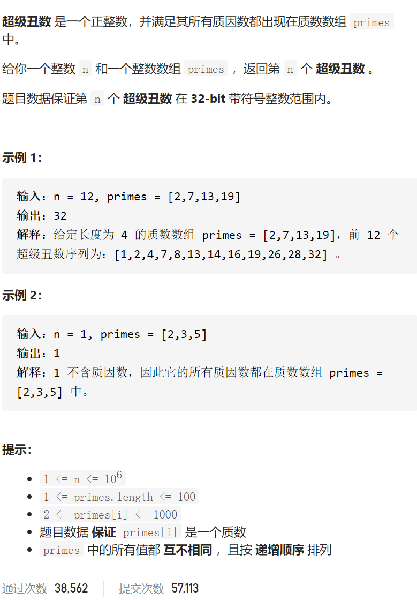

超级丑数

变量简洁正确完整思路

最小堆，放入1，取出n次，每取出一次num放入num*prime插入，哈希集与最小堆同步防止重

```c
class Solution {
public:
    int nthSuperUglyNumber(int n, vector<int>& primes) {
        unordered_set<int>seen;
        priority_queue<int,vector<int>,greater<int>>heap;
        heap.push(1);
        while(--n){
            int tmp=heap.top();heap.pop();
            //cout<<tmp<<' ';
            for(int prime:primes){
                int num=min(tmp,INT_MAX/prime)*prime;
                if(seen.count(num))continue;
                heap.push(num);
                //cout<<num<<' ';
                seen.insert(num);
            }
        }
        return heap.top();

    }
};
```


dp i是第i个最小的丑数dp0=1，p[j]是将要尝试更新的下一个dpi，从primes中选一个

最小的dp[p[j]]*primes[j]作为dpi的值，与dpi相同要pj++，这样pj才是要尝试的

下一个dpi

```c
class Solution {
public:
    int nthSuperUglyNumber(int n, vector<int>& primes) {
        vector<int>dp(n);
        dp[0]=1;
        int m=primes.size();
        vector<int>p(m,0);
        for(int i=1;i<n;i++){
            int ans1=INT_MAX;
            for(int j=0;j<m;j++){
                //cout<<i<<' '<<j<<' '<<dp[p[j]]*primes[j]<<endl;
                ans1=min(ans1,dp[p[j]]*primes[j]);
            }
            dp[i]=ans1;
            for(int j=0;j<m;j++){
                if(dp[p[j]]*primes[j]==ans1)p[j]++;
            }
        }
        return dp[n-1];
    }
};
```


